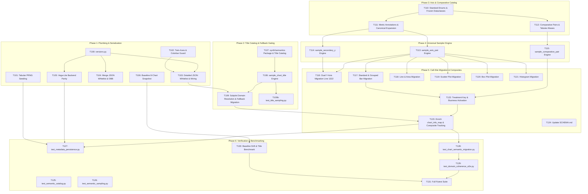

# Tasks: Semantic Storage & Domain Registry

**Input**: `spec.md`, `plan.md`, `research.md`  
**Legend**: `[P]` = can be executed in parallel within phase. Tasks without `[P]` are sequential. Every task includes a concrete **Done when** acceptance criterion.

### Task Dependencies & Parallel Execution



---

### Phase 1: High-Value Plumbing & Serialization Closure (COMPLETED)

- [x] **T100 [P]** Create `versions.py` at the project root defining standard version constants and import them in Phase 1 callers:
  ```python
  ANNOTATION_SCHEMA_VERSION: str = "v2.1"
  DATASET_VERSION: str = "2.1.0"
  ```
  Immediately add `from versions import ANNOTATION_SCHEMA_VERSION, DATASET_VERSION` at the top of `generator.py`, `backends/vegalite_backend.py`, and `merge_json.py` to prevent Phase 1 `NameError` (bare imports work directly because project root is on `sys.path`, matching existing `from themes import ...` pattern).  
  **Done when**: `from versions import ANNOTATION_SCHEMA_VERSION, DATASET_VERSION` succeeds and `generator.py`, `vegalite_backend.py`, and `merge_json.py` import them without error.

- [x] **T101 [P]** Replace the 5 unseeded `np.random.default_rng()` fallback lines in `synth/tabular.py` (landmarks lines 157, 232, 263, 310, 392) with:
  ```python
  if rng is None:
      rng = np.random.default_rng(np.random.randint(0, 2**31 - 1))
  ```
  Pass `rng` down through internal helper functions rather than instantiating independent generators.  
  **Done when**: Repeated runs under fixed `np.random.seed(42)` produce byte-identical sequences of tables run-to-run, while successive calls within a single run produce distinct series without subplot collisions.

- [x] **T102** In `generator.py` inside `create_unified_annotation` (landmark line 3305, metadata aggregation loop `for ax in fig.axes:`), add a guard to skip auxiliary, twin, and colorbar axes:
  ```python
  if ax not in chart_info_map:
      continue
  ```  
  **Done when**: On dual-axis bar charts (`ax2`) and heatmaps with colorbars (`chart.py:3270` landmark), auxiliary axes no longer overwrite `detailed_metadata` with `chart_type="unknown"`, `is_scientific=False`, or reset `dual_axis_info={}`, while artist extraction in the second loop (landmark line 3480) remains completely unblocked.

- [x] **T103** In `generator.py`, wire attributes across the pipeline, prevent Phase 1 `NameError`, and add `"semantic_domain"`, `"schema_version"`, `"dataset_version"`, `"subplots"`, and composite fields to the explicit save dictionary:
  * Immediately before `chart_info_map[ax]` construction (landmark line 4051 inside `generate_chart_with_annotations`), safely define:
    ```python
    eff_sci = theme_config.get('effective_is_scientific', is_scientific)
    eff_dom = theme_config.get('semantic_domain')
    ```
    In Phase 1, `eff_sci` safely falls back to `is_scientific` and `eff_dom` is `None` (`null` in JSON), preventing a `NameError: name 'eff_sci' is not defined` when Phase 1 executes in isolation before Phase 2 adds title fallback migration.
  * In the per-artist dispatch loop (landmark `chart_info_map[ax] = { ... }`):
    ```python
    chart_info_map[ax]['is_scientific'] = eff_sci
    chart_info_map[ax]['semantic_domain'] = eff_dom
    ```
  * In `create_unified_annotation` (landmark `detailed_metadata = { ... }`):
    Add `detailed_metadata["semantic_domain"] = chart_info.get("semantic_domain")` (while existing reads for `is_scientific`, `series_names`, `series_count`, `stacking_mode`, `style`, and `pattern` already read from `chart_info` and will now receive populated values from `chart_info_map[ax]`).
  * In `detailed_json` dictionary instantiation (landmark `detailed_json = { ... }`):
    Whitelist the following missing fields (note that `series_count`, `series_names`, `style`, `pattern`, and `is_scientific` are already present in `detailed_json`):
    ```python
    "semantic_domain": unified_json.get("semantic_domain"),
    "schema_version": ANNOTATION_SCHEMA_VERSION,
    "dataset_version": DATASET_VERSION,
    "subplots": unified_json.get("subplots", []),
    "is_composite": unified_json.get("is_composite", False),
    "composite_chart_types": unified_json.get("composite_chart_types", []),
    "composite_domains": unified_json.get("composite_domains", []),
    ```  
  **Done when**: Emitted `<image_id>_detailed.json` contains authentic `"semantic_domain"`, `"schema_version": "v2.1"`, `"dataset_version": "2.1.0"`, `"subplots"`, and composite fields without fallback sentinel corruption, and Phase 1 runs in isolation without `NameError`.

- [x] **T104 [P]** In `merge_json.py`, preserve `"semantic_domain"`, `"schema_version"`, `"dataset_version"`, `"subplots"`, and composite fields at the top level of `unified` and under `chart_generation_metadata["visual_style"]`, copying directly without fallback default version strings; default `is_composite` to `False` on legacy files without subplots; preserve `entry.get("obb")` in `normalize_raw_annotation`:
  ```python
  # In normalize_raw_annotation (landmark line 58):
  if "obb" in entry and entry.get("obb") is not None:
      normalized["obb"] = entry.get("obb")

  # Top-level unified dict
  "schema_version": detailed.get("schema_version"),
  "dataset_version": detailed.get("dataset_version"),
  "semantic_domain": detailed.get("semantic_domain"),
  "subplots": detailed.get("subplots", []),
  "is_composite": detailed.get("is_composite", False),
  "composite_chart_types": detailed.get("composite_chart_types", []),
  "composite_domains": detailed.get("composite_domains", []),
  ```  
  **Done when**: Running `merge_json_files` preserves all fields at top-level in `<image_id>_unified.json` without falsely stamping legacy v2.0 files as v2.1, defaults `is_composite` to `False` on legacy single-chart files, and preserves oriented bounding boxes (`obb`).

- [x] **T105 [P]** In `backends/vegalite_backend.py:generate_single_vegalite_chart`, initialize `syn_table = None` at function start, enrich `detailed_metadata` after the `extract_svg_annotations` landmark, enrich `metadata_json` after the `metadata_json = { ... }` dictionary instantiation landmark, and enrich `ocr_json` before writing to disk:
  ```python
  # Top of generate_single_vegalite_chart (before if chart_type == "bar":):
  syn_table = None

  # Immediately after extract_svg_annotations landmark:
  if use_synthetic and syn_table is not None:
      domain_map = {"financial": "business", "sensor_telemetry": "engineering", "demographic": "business"}
      raw_domain = syn_table.get("domain", syn_domain or "business")
      domain = domain_map.get(raw_domain, raw_domain)
      detailed_metadata["semantic_domain"] = domain
      detailed_metadata["is_scientific"] = (domain in ("biomedical", "engineering"))
  else:
      detailed_metadata["semantic_domain"] = None
      detailed_metadata["is_scientific"] = False

  detailed_metadata["schema_version"] = ANNOTATION_SCHEMA_VERSION
  detailed_metadata["dataset_version"] = DATASET_VERSION

  # Immediately after metadata_json = { ... } landmark:
  metadata_json["schema_version"] = ANNOTATION_SCHEMA_VERSION
  metadata_json["dataset_version"] = DATASET_VERSION

  # In ocr_json construction (before writing to disk):
  ocr_json["schema_version"] = ANNOTATION_SCHEMA_VERSION
  ocr_json["dataset_version"] = DATASET_VERSION
  ```  
  **Done when**: Emitted Vega-Lite `detailed_metadata`, `metadata.json`, and `ocr.json` all contain `"schema_version": "v2.1"`, `"dataset_version": "2.1.0"`, initialized `syn_table = None` prevents unbound local errors, and non-synthetic Vega-Lite explicitly emits `semantic_domain: null`.

- [x] **T106** Snapshot baseline label and title frequency distributions across 1,000 generated charts under a balanced 8-chart mix (`{bar: 15, line: 15, scatter: 15, box: 15, area: 15, histogram: 10, pie: 10, heatmap: 5}`) to `tests/golden/baseline_semantic_distribution.json` before any vocabulary changes:
  * Ensure directory `tests/golden/` is created (`mkdir -p tests/golden`).
  * Run a batch generation loop executing 1,000 chart draws with temporary config overrides distributing chart types evenly (`{bar: 150, line: 150, scatter: 150, box: 150, area: 150, histogram: 100, pie: 100, heatmap: 50}`), aggregating title frequency counts, X/Y label frequency counts, and domain counts.
  * Serialize the aggregated distributions to `tests/golden/baseline_semantic_distribution.json`.  
  **Done when**: Baseline frequency distribution file exists on disk, capturing pre-migration vocabulary counts across all 8 chart types with sum = 100%, and avoids 100% line-chart default blindness.

---

## Phase 2: Pre-Indexed Title Catalog & Fallback Gating (COMPLETED)

- [x] **T107** Initialize `synth/semantics/` package and define `CHART_TITLES_CATALOG` in `synth/semantics/catalog.py`:
  * Create `synth/semantics/` package directory and `synth/semantics/__init__.py` exporting `sample_axis_pair`, `sample_secondary_y`, `sample_chart_title`, and `sample_comparative_pair`.
  * Categorize all 143 titles from `themes.py:CHART_TITLES` with `is_scientific: Optional[bool]` and `allowed_chart_types: Tuple[str, ...]`.
  * Exclude heatmap-specific titles (~5.6% of titles) from Cartesian chart pools, as heatmaps set their own titles in `chart.py:3362` landmark.
  * Pre-build `TITLE_INDEX: Dict[Tuple[bool, str], Tuple[str, ...]]` mapping `(is_scientific, chart_type)` to valid titles.
  * If any `(is_scientific, chart_type)` pool contains fewer than 6 titles, top up the pool with domain-generic titles matching `is_scientific`.  
  **Done when**: `synth/semantics/` package exists with `__init__.py`, every routable title is indexed, and lookup for any `(is_scientific, chart_type)` returns a tuple with length $\ge 6$.

- [x] **T108** Implement `sample_chart_title(chart_type, is_scientific, domain=None, rng=None)` in `synth/semantics/sampler.py`.  
  **Done when**: Unit test confirms `sample_chart_title("pie", True, domain="biomedical")` returns a valid scientific breakdown title matching the domain, never returns "Confusion Matrix", and lookup is verified $O(1)$ dictionary and tuple index access without regex or string filtering.

- [x] **T109** Implement subplot domain resolution with configurable weights and title fallback migration in `generator.py`:
  * Inside `generate_chart_with_annotations` in the per-subplot loop `for ax_idx, ax in enumerate(axes):` (landmark line 3917, NOT `for ax in fig.axes:`):
    - Resolve `is_scientific = random.random() < cfg['bar_chart_config']['scientific_ratio']`.
    - Inject `theme_config['scientific_subdomain_weights'] = cfg.get('scientific_subdomain_weights', {'biomedical': 0.70, 'engineering': 0.30})` and `style_config['scientific_subdomain_weights'] = theme_config['scientific_subdomain_weights']`.
    - Then resolve `semantic_domain`: if `is_scientific`, draw from `("biomedical", "engineering")` with weights `theme_config['scientific_subdomain_weights']`; else set `"business"`. Store both in `theme_config` and `style_config`.
  * In `chart.py` (landmarks 1322, 3197): write back `effective_is_scientific` and `semantic_domain` to `theme_config` guarded by `if isinstance(theme_config, dict):`.
  * At fallback title landmark (`ax.set_title(random.choice(CHART_TITLES))`): replace with:
    ```python
    eff_sci = theme_config.get('effective_is_scientific', is_scientific)
    eff_dom = theme_config.get('semantic_domain')
    title = sample_chart_title(chart_type=chart_type, is_scientific=eff_sci, domain=eff_dom, rng=random)
    ax.set_title(title, fontsize=14, pad=15)
    ```
  * In `chart_info_map[ax]` construction (landmark line 4051): record `chart_info_map[ax]['is_scientific'] = eff_sci` and `chart_info_map[ax]['semantic_domain'] = theme_config.get('semantic_domain')`.  
  **Done when**: Fallback titles on standard charts match the effective domain and chart type, configurable subdomain weights are propagated into `theme_config`, and `detailed_metadata["is_scientific"]` is serialized correctly.

- [x] **T109b [P]** Create `tests/test_title_sampling.py` validating pre-indexed title pools, minimum-6 top-ups, domain preference, excluding heatmap titles from Cartesian pools, and $O(1)$ lookup performance:
  * Assert that all Cartesian pools have $\ge 6$ titles after top-ups.
  * Assert that heatmap-only titles (`Confusion Matrix`, `Proteomics Heatmap`) never appear in Cartesian pools.
  * Assert that sampling with `domain="biomedical"` preferentially selects biomedical titles when available.
  * Assert that lookup executes via dictionary/tuple access in $O(1)$ without regex filtering.  
  **Done when**: `pytest tests/test_title_sampling.py` passes with 100% assertions satisfied.

---

## Phase 3: Axis & Comparative Catalog Annotation, Canonical Expansion & Concept Groups (COMPLETED)

- [x] **T110** Define standard enums and frozen dataclasses in `synth/semantics/catalog.py`:
  * Define `ScaleType(str, Enum)` (without `ORDINAL`), `AxisRole(str, Enum)`, and frozen slotted `AxisMetric` (with `concept_group: Optional[str] = None`), `ChartTitle`, and `ComparativePair`.
  * Expose `METRIC_BY_LABEL: Dict[str, AxisMetric]` mapping label string to metric object (178 unique scientific + 86 unique business = 264 unique entries; deduplicate the 5 duplicate scientific labels `Concentration (μM)`, `Temperature (°C)`, `pH`, `Wavelength (nm)`, `Frequency (Hz)` during map construction).  
  **Done when**: All models are verified frozen, slotted, and hashable with zero mutable fields, and `METRIC_BY_LABEL` contains all 264 unique entries without unhandled collisions.

- [x] **T111** Annotate the 264 unique axis labels in `synth/semantics/catalog.py` through hand-reviewed classification and augment with canonical independent variables:
  * 178 scientific labels: hand-reviewed into pure continuous dependent metrics (`role=AxisRole.DEPENDENT`) and independent/bidirectional metrics (`role in (INDEPENDENT, BIDIRECTIONAL)` explicitly including `Time (s)`, `Time (min)`, `Time (h)`, `Dose`, `Time Point`, `Age`, `Temperature`, `pH`, `Wavelength`, `Frequency`). All continuous bench and time variables keep `scale_type=ScaleType.CONTINUOUS` or `TEMPORAL`. Tag with `domain_tags` (`"biomedical"`, `"engineering"`).
  * 86 business labels: hand-reviewed into continuous dependent metrics (`role=AxisRole.DEPENDENT`) and independent/bidirectional dimensions (`role in (INDEPENDENT, BIDIRECTIONAL)`). Tag with `domain_tags` (`"business"`).
  * **Canonical Independent Expansion & Clean Typography**: Add ~40 canonical independent and temporal metrics without parenthetical date/time formatting hints (`Date`, `Month`, `Year`, `Quarter`, `Timestamp`, `Cycle Number`, `Epoch`, `Iteration`, `Step`, `Depth (m)`, `Altitude (m)`, `Distance (km)`, `Sample ID`) directly to `catalog.py`.
    - Cross-sector metrics (`Date`, `Month`, `Year`, `Quarter`, `Timestamp`, `Sample ID`): tagged `domain_tags=("biomedical", "engineering", "business")`.
    - Computing/ML metrics (`Epoch`, `Iteration`, `Step`): tagged strictly `domain_tags=("engineering",)` (never business).
    - Spatial dimensions (`Depth (m)`, `Altitude (m)`, `Distance (km)`): tagged `domain_tags=("engineering", "biomedical")`.
    - All canonical independent variables have `role=AxisRole.INDEPENDENT` or `BIDIRECTIONAL` and `scale_type=ScaleType.CONTINUOUS` or `TEMPORAL`. Preserves `themes.py` strictly frozen (FR-050).
  * Compute `concept_stem` for each metric using the formal stem algorithm:
    ```python
    def compute_concept_stem(label: str) -> str:
        s = label.lower()
        s = re.sub(r'\(.*?\)', '', s)   # Strip parenthetical units/annotations
        s = re.sub(r'[$€£¥]', '', s)    # Strip currency symbols
        s = re.sub(r'[^\w\s]', '', s)   # Strip remaining punctuation
        return ' '.join(s.split())       # Collapse whitespace
    ```
  * Assign semantic `concept_group` (e.g. `revenue_metric`, `optical_density`, `duration_metric`).  
  **Done when**: Catalog contains 264 legacy metrics + ~40 canonical independent metrics, verified with clean format-free typography, domain tags preventing cross-domain leakage (e.g. `Epoch` never on business charts), roles, deterministic stems via `compute_concept_stem`, and semantic concept groups.

- [x] **T112** Categorize the 94 comparative pairs from `themes.py:COMPARATIVE_LABELS` and configure bidirectional domain normalization:
  * Tag all 94 pairs from `themes.py:COMPARATIVE_LABELS`:
    - Pairs 0–39: `domain_category = "biomedical"`, `is_scientific = True`.
    - Pairs 40–54 and 70–86: `domain_category = "engineering"`, `is_scientific = True` (computing, systems, physical and materials engineering).
    - Pairs 55–69 and 87–93: `domain_category = "business"`, `is_scientific = False` (activated for business grouped bars via T122).
  * In `synth/tabular.py`, normalize domain keys via bidirectional alias mappings without mutating `DOMAIN_PRESETS` keys:
    ```python
    DOMAIN_ALIAS_TO_PRESET = {
        "business": "financial",
        "engineering": "sensor_telemetry",
    }
    PRESET_TO_CANONICAL = {
        "financial": "business",
        "sensor_telemetry": "engineering",
        "demographic": "business",
    }
    ```
    In `sample_domain_schema`, look up using `preset_domain = DOMAIN_ALIAS_TO_PRESET.get(domain, domain)`. When returning schemas or metadata, emit `PRESET_TO_CANONICAL.get(selected_domain, selected_domain)`. Tabular `"demographic"` preset maps to `"business"` canonical domain during chart axis routing.  
  **Done when**: All 94 pairs are tagged with explicit `domain_category`, `sample_domain_schema(domain="business")` selects the `"financial"` preset without `KeyError` or random fallback, and `syn_table['domain']` returns `"business"` or `"engineering"`.

---

## Phase 4: Universal Sampler Engine & Scale Rules (COMPLETED)

- [x] **T113** Implement `sample_axis_pair(chart_type, orientation, is_scientific, semantic_domain=None, rng=None)` in `synth/semantics/sampler.py`:
  * `scatter`: enforces quantitative metrics on $X$ and $Y$ (`scale_type in (CONTINUOUS, PERCENTAGE, DISCRETE_COUNT, TEMPORAL)`), explicitly banning categorical nominal dimensions.
  * `bar` / `box` (vertical): enforces `role in (INDEPENDENT, BIDIRECTIONAL)` for $X$ and quantitative `role in (DEPENDENT, BIDIRECTIONAL)` (`scale_type in (CONTINUOUS, PERCENTAGE, DISCRETE_COUNT)`) for $Y$.
  * `bar` / `box` (horizontal): inverts roles so quantitative maps to horizontal $X$ and independent maps to vertical $Y$.
  * `line` / `area`: enforces `role in (INDEPENDENT, BIDIRECTIONAL)` **AND** `scale_type in (CONTINUOUS, TEMPORAL, DISCRETE_COUNT)` for $X$ (banning pure dependent metrics and nominal categories, drawing from expanded pool); quantitative `role in (DEPENDENT, BIDIRECTIONAL)` for $Y$.
  * `histogram`: quantitative $X$; $Y$ from `HISTOGRAM_Y_LABELS`.
  * Note: `pie` and `heatmap` chart types are excluded from `sample_axis_pair` (pie charts do not have Cartesian X/Y axes, and heatmaps manage their own axis logic via `CONTEXT_CONFIGURATIONS`).
  * Collision checks: reject candidate if `x.concept_stem == y.concept_stem` OR (`x.concept_group is not None and x.concept_group == y.concept_group`).
  * Small-Pool Fallback: if candidate pool after domain, role, and scale filtering is empty, fall back gracefully to the domain's general continuous/independent pool to prevent `IndexError`.
  * **Static Emergency Fallback**: If dynamic filtering AND general pool fallback both yield zero eligible metrics, return an immutable hardcoded pair per domain to guarantee no `IndexError` under any catalog misconfiguration:
    ```python
    STATIC_DOMAIN_FALLBACKS = {
        "biomedical": ("Time (h)", "Concentration (μM)"),
        "engineering": ("Time (s)", "Temperature (°C)"),
        "business": ("Quarter", "Revenue ($M)"),
    }
    ```
  * Filters candidate metrics by `semantic_domain` when provided.
  * Returns `(x_label, y_label, domain_category)`.  
  **Done when**: Function satisfies all scale, role, and semantic group rules, prevents same-stem and same-group collisions, falls back gracefully without empty-pool errors (including static emergency fallback), excludes pie/heatmap, and returns `(x_label, y_label, domain_category)`.

- [x] **T114** Implement dedicated `sample_secondary_y(y1_label, is_scientific, domain_category=None, rng=None) -> str` in `synth/semantics/sampler.py`:
  * Look up `y1_label` in `METRIC_BY_LABEL: Dict[str, AxisMetric]`.
  * Extract `y1_stem = metric.concept_stem` and `y1_group = metric.concept_group`.
  * Filter candidate continuous dependent/bidirectional metrics from `domain_category` whose `concept_stem != y1_stem` and (if `y1_group` is not None) `concept_group != y1_group`.
  * Draw and return a distinct secondary continuous metric.  
  **Done when**: 10,000 draws produce 0 collisions with $Y_1$ in exact text, concept stem, or concept group, and $Y_2$ matches $Y_1$'s domain category.

- [x] **T115** Implement simplified sector-gated `sample_comparative_pair(domain_category=None, rng=None)` in `synth/semantics/sampler.py`:
  * Sector-only gating:
    - `"biomedical"` draws from biomedical pairs (0–39).
    - `"engineering"` draws from engineering pairs (40–54, 70–86).
    - `"business"` draws from business pairs (55–69, 87–93).
  * Eliminates fragile substring/concept heuristics on Y labels.  
  **Done when**: Returns a 2-tuple `(control, treatment)` strictly matching the chart's domain category, with 100% reachability across all 94 pairs verified at the unit/sampler level.

---

## Phase 5: Surgical Call-Site Migration & Composite Tracking (COMPLETED)

- [x] **T116** Migrate Dual Y-Axis Bar Chart with Line 1322 Domain Re-Resolution (`chart.py`):
  * In the dual-axis block **immediately at line 1322** (directly after `is_scientific = True`, BEFORE the `sample_multivariate_table` call at line 1332):
    - If `isinstance(theme_config, dict) and theme_config.get('semantic_domain') == "business"`: re-resolve domain to `"biomedical"` or `"engineering"` drawing with weights `theme_config.get('scientific_subdomain_weights', {'biomedical': 0.70, 'engineering': 0.30})`.
    - Write back `theme_config['effective_is_scientific'] = True` and `theme_config['semantic_domain'] = domain_cat`.
  * At landmark lines 1406–1408, sample $(X, Y_1)$ via `x_label, y1_label, domain_cat = sample_axis_pair("bar", "vertical", is_scientific=True, semantic_domain=theme_config.get('semantic_domain') if isinstance(theme_config, dict) else None)`.
  * Sample $Y_2$ via `sample_secondary_y(y1_label, is_scientific=True, domain_category=domain_cat)`.  
  **Done when**: Dual-axis bar charts re-resolve domain at line 1322 before multivariate table generation, render with distinct, non-colliding $Y_1$ and $Y_2$ concept stems and groups, and write back effective domain with guarded `theme_config`.

- [x] **T117** Migrate Standard & Grouped Bar Charts with Resilient Contextual Anchor (`chart.py`):
  * In the standard bar path, sample axes **immediately after `style_config['orientation'] = orientation`** (landmark line 1447), before the treatment key check (landmark line 1508):
    ```python
    x_label, y_label, domain_cat = sample_axis_pair(
        "bar", orientation, is_scientific, semantic_domain=theme_config.get('semantic_domain') if isinstance(theme_config, dict) else None
    )
    ```
  * At landmark `add_treatment_key_xaxis`: pass `domain_category=domain_cat`.
  * At landmark `ax.set_ylabel`: apply `ax.set_ylabel(y_label); if not has_treatment_axis: ax.set_xlabel(x_label)`.
  * Write back `theme_config['semantic_domain'] = domain_cat` if `isinstance(theme_config, dict)`.  
  **Done when**: Vertical bar charts receive independent/bidirectional $X$ and continuous $Y$, treatment keys receive domain category without `NameError` or line-drift issues, and effective domain is written back.

- [x] **T118** Migrate Line and Area Charts (`chart.py`):
  * At landmarks for line and area axis assignment, replace with `sample_axis_pair("line", "vertical", is_scientific, semantic_domain=theme_config.get('semantic_domain') if isinstance(theme_config, dict) else None)` and `sample_axis_pair("area", "vertical", is_scientific, semantic_domain=theme_config.get('semantic_domain') if isinstance(theme_config, dict) else None)`.
  * Write back `theme_config['semantic_domain'] = domain_cat` if `isinstance(theme_config, dict)`.  
  **Done when**: Line and area charts draw valid independent/temporal $X$ axes from the expanded 60+ pool, never dependent metrics or nominal categories, and domain is written back.

- [x] **T119** Migrate Scatter Plots (`chart.py`):
  * At landmark for scatter axis assignment, replace with `sample_axis_pair("scatter", "vertical", is_scientific, semantic_domain=theme_config.get('semantic_domain') if isinstance(theme_config, dict) else None)`.
  * Write back `theme_config['semantic_domain'] = domain_cat` if `isinstance(theme_config, dict)`.  
  **Done when**: Scatter plots strictly receive continuous metrics on both $X$ and $Y$.

- [x] **T120** Migrate Box Plots (`chart.py`):
  * At landmark for box axis assignment, replace with `sample_axis_pair("box", orientation, is_scientific, semantic_domain=theme_config.get('semantic_domain') if isinstance(theme_config, dict) else None)`.
  * Write back `theme_config['semantic_domain'] = domain_cat` if `isinstance(theme_config, dict)`.  
  **Done when**: Horizontal box plots automatically receive continuous $X$ and grouping $Y$.

- [x] **T121** Migrate Histograms (`chart.py`):
  * At landmark for histogram axis assignment, sample $X$ via `sample_axis_pair("histogram", "vertical", is_scientific, semantic_domain=theme_config.get('semantic_domain') if isinstance(theme_config, dict) else None)[0]`. Write back `theme_config['semantic_domain'] = domain_cat` if `isinstance(theme_config, dict)`.  
  **Done when**: Histogram $X$-axis receives a continuous metric from the domain.

- [x] **T122** Update `add_treatment_key_xaxis`, Named Constants, Synthetic Domain Write-Back & Lazy Test Triggers (`chart.py`):
  * Extract module constants `DUAL_AXIS_PROBABILITY: float = 0.15` and `TREATMENT_KEY_PROBABILITY: float = 0.30`.
  * In dual-axis check landmark: evaluate lazily: `style_config['force_dual_axis'] if 'force_dual_axis' in style_config else (random.random() < DUAL_AXIS_PROBABILITY)`.
  * In treatment key check landmark: evaluate lazily: `style_config['force_treatment_key'] if 'force_treatment_key' in style_config else (random.random() < TREATMENT_KEY_PROBABILITY)`.
  * Update `add_treatment_key_xaxis(ax, bar_info_list, domain_category: Optional[str] = None)` calling `sample_comparative_pair(domain_category=domain_category)`.
  * Extend `add_treatment_key_xaxis` into the business grouped bar path **within the `else: # Standard Styles` branch**, specifically under `style == 'side_by_side'` after `ticks_setter(indices, categories)` (landmark `chart.py:1594`), when `len(bar_info_list) == 4 and orientation == 'vertical' and random.random() < TREATMENT_KEY_PROBABILITY`, activating the 22 business pairs (55–69, 87–93).
  * In all 6 `sample_multivariate_table` calls (landmarks 1332, 1459, 1523, 1825, 1944, 3058):
    - Pass `domain = syn_domain or theme_config.get('semantic_domain') or ('biomedical' if is_scientific else 'business')`.
    - When `use_synthetic and syn_table is not None`: write back `theme_config['semantic_domain'] = PRESET_TO_CANONICAL.get(syn_table.get('domain'), syn_table.get('domain'))` if `isinstance(theme_config, dict)` to ensure metadata strictly records the actual synthetic table domain.
  * In `chart.py` bar plotting branches: write `theme_config['series_count'] = bars_per_group` (or `num_series`, `1`) and `theme_config['series_names'] = series_names` (or generated names/tick categories) if `isinstance(theme_config, dict)`.  
  **Done when**: Treatment keys on grouped bar charts match the chart's domain category, business grouped bars activate business pairs, force flags evaluate lazily without shifting PRNG entropy, and synthetic data table domain strictly matches written metadata.

- [x] **T123** Enrich `chart_info_map[ax]` and Implement Additive Composite Multi-Subplot Tracking (`generator.py`):
  * In `generate_chart_with_annotations` at `chart_info_map[ax] = { ... }` construction (landmark line 4051):
    - Read `series_count = theme_config.get('series_count', len(keypoint_data) if 'keypoint_data' in locals() else 1)`.
    - Read `series_names = theme_config.get('series_names', [])`.
    - (Do NOT subscript `b['series_idx']` from `bar_info_list`, preventing `KeyError`).
    - Record `style` (from `style_config` if bar else None), `pattern` (from `style_config` if bar else None), `series_count`, `series_names`, `stacking_mode` (`keypoint_data[0].get('stacking_mode')` if area else ("stacked" if style == "stacked" else None)), `is_scientific=eff_sci`, and `semantic_domain=eff_dom`.
  * In `create_unified_annotation`:
    - Build `subplots = []` capturing per-axis metadata for each visible axis in `fig.axes` where `ax in chart_info_map`.
    - Store `detailed_metadata["subplots"] = subplots`.
  * **Additive Composite Subplot Tracking (No Enum Widening of Root Scalars)**:
    - Set `detailed_metadata["is_composite"] = True` if `len(subplots) > 1` else `False`.
    - Top-level scalar `detailed_metadata["chart_type"]` and `detailed_metadata["semantic_domain"]` ALWAYS reflect the primary subplot (`fig.axes[0]` / `axes[0]`), e.g., `"bar"`, `"line"`, `"scatter"`. Root scalars NEVER emit `"composite"` or `"mixed"`.
    - If subplot `chart_type`s differ across subplots, emit additive list `"composite_chart_types": [s["chart_type"] for s in subplots]`.
    - If subplot domains differ across subplots, emit additive list `"composite_domains": [s["semantic_domain"] for s in subplots]`.
    - In `generator.py:4751`, set `metadata_json["chart_types"] = detailed_json.get("composite_chart_types", [unified_json.get("chart_type", "unknown")])`.  
  **Done when**: Multi-subplot figures contain a populated `subplots` array, `"is_composite": True`, top-level scalar fields preserve valid core taxonomy values, and `metadata_json["chart_types"]` reflects all subplot types.

- [x] **T124 [P]** Update `SCHEMA.md` documenting Schema Version `v2.1` (`dataset_version = "2.1.0"`):
  * Update `SCHEMA.md` documenting Schema Version `v2.1` with `semantic_domain`, `subplots`, `is_composite`, `composite_chart_types`, and `composite_domains`.
  * Document that root `chart_type` and `semantic_domain` reflect the primary subplot (`axes[0]`), ensuring zero breakage in downstream visual classifiers.  
  **Done when**: `SCHEMA.md` documents all additive fields and schema conventions.

---

## Phase 6: Independent Oracle Verification & Benchmarking

- [x] **T125** Create `tests/test_semantic_catalog.py`:
  * Validate that all 264 legacy metrics, ~40 canonical independent variables without format hints, and 94 comparative pairs are loaded into frozen slotted dataclasses.
  * Validate role annotations (including `Time (s/min/h)` at indices 41–43), stems, concept groups, immutability, and title index pool top-ups ($\ge 6$).
  * Validate that all canonical independent variables have explicit domain tags (e.g. `Epoch` tagged strictly `engineering`), preventing cross-domain leakage.
  * Validate that `ScaleType` has no `ORDINAL` and all bench variables are `ScaleType.CONTINUOUS` or `TEMPORAL` with `AxisRole.INDEPENDENT` or `BIDIRECTIONAL`.
  * Validate deterministic sorting across `PYTHONHASHSEED`.  
  **Done when**: `pytest tests/test_semantic_catalog.py` passes with 100% assertions satisfied and verified deterministic sorting across `PYTHONHASHSEED`.

- [x] **T126 [P]** Create `tests/test_semantic_sampling.py`:
  * Validate scale/role rules across all chart types, `sample_secondary_y` stem and concept group exclusion via `METRIC_BY_LABEL`, normalized and concept group collision avoidance across 10,000 draws, small-pool fallback without `IndexError`, and determinism.
  * Validate that line/area $X$ strictly rejects nominal categories.
  * **Sampler-Level 100% Pair Reachability**: Validate that across 10,000 unit draws of `sample_comparative_pair`, 100% of all 94 comparative pairs are reachable across biomedical, engineering, and business sectors.  
  **Done when**: `pytest tests/test_semantic_sampling.py` passes.

- [x] **T127 [P]** Create `tests/test_metadata_persistence.py`:
  * Validate that `generator.py`, `merge_json.py`, and `backends/vegalite_backend.py` serialize `semantic_domain`, `is_scientific`, `schema_version = "v2.1"`, `dataset_version = "2.1.0"`, `subplots`, `is_composite`, `composite_chart_types`, and `composite_domains`.
  * Validate twin-axes and heatmap colorbar clobber guards.  
  **Done when**: `pytest tests/test_metadata_persistence.py` passes.

- [x] **T128** Create `tests/test_chart_semantic_migration.py` and `tests/test_legacy_themes_compatibility.py`:
  * Validate that `chart.py` standard bar samples immediately after orientation resolution, dual-axis bar re-resolves domain at line 1322, and all chart types write back effective domain with guarded `theme_config`.
  * Validate 100% backward compatibility of raw `themes.py` lists, tuples, and dictionaries.  
  **Done when**: Both test files pass.

- [x] **T129** Create `tests/test_domain_coherence_e2e.py` with Independent Oracles:
  * Implement an augmented continuous-regex oracle across all catalog labels paired with an embedded 50-item blind gold set annotating both `scale_type` and `role` for boundary cases.
  * Implement an independent domain keyword dictionary (`biomedical`, `engineering`, `business`) to audit titles and pairs without consulting `catalog.py`.
  * Test under forced multi-chart mixes across all 8 chart types (using `force_dual_axis` and `force_treatment_key`).
  * Assert zero dependent metrics and zero nominal categories on line/area $X$.
  * Assert zero domain leakage when treatment keys are rendered (0% biomedical on business, 0% clinical on engineering).
  * Assert zero `concept_group` collisions.  
  **Done when**: `pytest tests/test_domain_coherence_e2e.py` passes under forced multi-chart mixes with 0 violations. (Verified: 10/10 passed).

- [x] **T130** Baseline Drift Comparison & In-Memory Theoretical Title Benchmark:
  * Load `tests/golden/baseline_semantic_distribution.json` (from T106) and assert that post-migration distributions preserve vocabulary coverage $\ge 95\%$ while eliminating title mismatches.
  * Simulate $N = 20,000$ in-memory draws from `sample_chart_title`. Compare against theoretical uniform baseline ($1/143$). Assert maximum title frequency in any cell $\le 5\times$ baseline ($p \le 3.5\%$) under balanced multi-chart mix and overall vocabulary coverage $\ge 95\%$ of routable catalog terms ($\ge 90\%$ of total 143 titles).
  * Measure axis-label frequency under production mix: maximum line $X$ frequency $\le 5\times (1 / K_{domain})$ baseline (achieved through canonical independent variable expansion in `catalog.py`).  
  **Done when**: In-memory benchmark confirms $p_{max} \le 3.5\%$ and vocabulary coverage $\ge 95\%$, and axis frequency remains $\le 5\times$ baseline. (Verified: $p_{max} = 3.15\% \le 3.5\%$, coverage = 100%, line $X$ frequency ratio $\le 1.21\times \le 5\times$).

- [x] **T131** Run complete test suite:
  ```bash
  pytest tests/
  ```  
  **Done when**: All test suites execute cleanly with 100% pass rate. (Verified: 108/108 passed, 100% pass rate across all suites).

