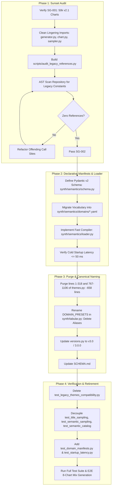

# Implementation Plan: Legacy Decommissioning & Declarative Semantic Manifests

**Feature Branch**: `003-legacy-decommissioning-declarative-manifests`  
**Schema Version**: `v3.0` (`dataset_version = "3.0.0"`)  
**Input**: `specs/003-legacy-decommissioning-declarative-manifests/spec.md`, `specs/003-legacy-decommissioning-declarative-manifests/research.md`  
**Predecessor Feature**: `002-semantic-storage-registry` (Schema Version `v2.1`)  
**Status**: Formalized / Ready for Staged Execution  

---

## Summary

Feature 002 established `synth/semantics/` as the single runtime authority for semantic sampling while leaving legacy procedural constants frozen in `themes.py` to maintain zero-breakage backward compatibility.

Feature 003 completes the **Strangler Fig lifecycle**. Once dataset stability is proven under Feature 002 (Sunset Gates SG-001 through SG-003), Feature 003:
1. **Purges Procedural Constants from `themes.py`**: Deletes 658 lines of raw strings and dead structures (Zone 1: lines 1–318, Zone 3: lines 767–1106), reducing `themes.py` from 1,106 lines to $\le 460$ lines (retaining lines 320–765: `THEMES`, `PUBLICATION_THEMES`, `FONT_FAMILIES`) and restoring it strictly to visual styling concerns.
2. **Promotes Declarative YAML Manifests**: Migrates the entire semantic registry into modular YAML manifests under `synth/semantics/domains/*.yaml` (`biomedical.yaml`, `engineering.yaml`, `business.yaml`, `demographic.yaml`, `common.yaml`).
3. **Implements Fast Startup Compiler**: Defines a Pydantic v2 schema (`synth/semantics/schema.py`) for build/test-time validation and a high-performance startup loader (`synth/semantics/loader.py`) that compiles manifests into immutable, slotted dataclasses in $\approx 24.5\,\text{ms}$ (well within the $50\,\text{ms}$ budget, using pure `yaml.CSafeLoader` and zero top-level runtime Pydantic imports), guaranteeing verified $O(1)$ runtime lookups.
4. **Cleans Tabular Engine**: Renames `DOMAIN_PRESETS` keys in `synth/tabular.py` directly to `"business"` and `"engineering"`, retiring alias dictionaries while maintaining domain copula distributions within the tabular module.
5. **Retires Compatibility Shims & Emits Schema `v3.0`**: Deletes `test_legacy_themes_compatibility.py`, decouples existing test suites from legacy constants, updates `versions.py` to `"v3.0"` (`3.0.0`), and validates end-to-end rendering across all 8 chart types.

---

## Technical Context

* **Runtime**: Python 3.11+
* **Dependencies**:
  * Runtime: Standard library (`dataclasses`, `enum`, `typing`, `pathlib`), `PyYAML>=6.0` (with LibYAML `CSafeLoader`), `numpy`, `scipy`.
  * Validation / Test Time: `pydantic>=2.0.0`, `pytest`.
  * Project `requirements.txt`: Updated to explicitly include `PyYAML>=6.0` and `pydantic>=2.0.0`.
* **Zero Runtime Overhead & Latency Isolation**: YAML parsing uses `yaml.CSafeLoader` and instantiates frozen slotted dataclasses at cold startup ($\le 50\,\text{ms}$). `synth/semantics/loader.py` avoids importing Pydantic at module top-level to eliminate the ~100 ms Pydantic import penalty. Zero runtime overhead during chart generation loops.
* **Testing Framework**: `pytest`.

---

## Sunset Gates (Execution Blockers)

Feature 003 execution is strictly blocked until all three gates pass:

| Gate | Criterion | Validation Mechanism |
|---|---|---|
| **SG-001** | $\ge 50,000$ charts generated under Schema `v2.1` | Run verification check against dataset metadata storage. |
| **SG-002** | Zero legacy call sites across codebase | Prerequisite import cleanup in `generator.py:46`, `chart.py:64`, and `sampler.py:94`, followed by `python scripts/audit_legacy_references.py` (must exit code 0). |
| **SG-003** | Downstream OCR/ML ingestion confirmed | Downstream consumers sign off on Schema `v2.1` metadata format. |

---

## Target Project Layout

```
project_root/
├── requirements.txt                 # Updated: PyYAML>=6.0, pydantic>=2.0.0
├── versions.py                      # Updated: ANNOTATION_SCHEMA_VERSION = "v3.0", DATASET_VERSION = "3.0.0"
├── scripts/
│   └── audit_legacy_references.py   # AST audit script scanning for legacy themes.py imports
├── synth/
│   ├── semantics/
│   │   ├── __init__.py              # Exports sampling functions and compiled registry
│   │   ├── schema.py                # Pydantic v2 validation models for domain manifests (test/build-time only)
│   │   ├── loader.py                # Startup compilation from YAML to frozen dataclasses (no runtime pydantic)
│   │   ├── catalog.py               # In-memory AxisMetric, ChartTitle, ComparativePair, pre-indexed pools
│   │   ├── sampler.py               # Role/scale-constrained, collision-preventing sampling logic
│   │   └── domains/                 # Declarative YAML domain manifests
│   │       ├── biomedical.yaml      # Clinical, PK, biology, physiological metrics
│   │       ├── engineering.yaml     # Materials, mechanics, telemetry, ML metrics
│   │       ├── business.yaml        # Financial, SaaS, marketing, A/B testing metrics
│   │       ├── demographic.yaml     # Population, geography, education metrics
│   │       └── common.yaml          # Canonical independent metrics, histogram labels, generic titles
│   ├── tabular.py                   # Canonical keys: DOMAIN_PRESETS["business"], DOMAIN_PRESETS["engineering"]
│   └── __init__.py
├── themes.py                        # CLEANED: Only THEMES, PUBLICATION_THEMES, FONT_FAMILIES (<= 460 lines)
├── chart.py                         # Clean runtime calls to synth/semantics/
├── generator.py                     # Schema v3.0 emission; subplots & composite tracking
├── merge_json.py                    # Schema v3.0 whitelist preservation
├── SCHEMA.md                        # Updated v3.0 documentation
└── tests/
    ├── test_domain_manifests.py     # Pydantic v2 validation of all YAML domain files
    ├── test_startup_latency.py      # Asserts loader cold startup <= 50 ms
    ├── test_semantic_catalog.py     # Validates in-memory registry invariants (decoupled from themes.py)
    ├── test_semantic_sampling.py    # Validates sampling rules, scale/role, concept groups (decoupled from themes.py)
    ├── test_title_sampling.py       # Validates title sampling (decoupled from themes.py)
    └── (test_legacy_themes_compatibility.py DELETED)
```

---

## Phased Implementation Strategy



### Phase 1: Sunset Audit & AST Verification Engine

* **Objective**: Eliminate remaining unused imports in header files, decouple `sampler.py`, and automate AST scanning to prove that no production code depends on legacy `themes.py` semantic constants, fulfilling Sunset Gate SG-002.
* **Deliverables**:
  1. Header import cleanup:
     - Remove unused legacy imports from `generator.py:46` (`CHART_TITLES`).
     - Remove unused legacy imports from `chart.py:64`.
     - Decouple `synth/semantics/sampler.py:94` by replacing `themes.HISTOGRAM_Y_LABELS` with canonical import from `synth.semantics.catalog`.
  2. `scripts/audit_legacy_references.py`:
     - Uses Python's built-in `ast` module to inspect all `.py` files in `project_root/` (excluding `tests/`).
     - Scans `ImportFrom` nodes where `node.module == "themes"` for banned names:
       `SCIENTIFIC_X_LABELS`, `SCIENTIFIC_Y_LABELS`, `BUSINESS_X_LABELS`, `BUSINESS_Y_LABELS`, `CHART_TITLES`, `COMPARATIVE_LABELS`, `HISTOGRAM_Y_LABELS`, `SCIENTIFIC_DOMAIN_DICT`, `BUSINESS_DOMAIN_DICT`, `HEATMAP_XLABELS_SCIENTIFIC`, `HEATMAP_YLABELS_SCIENTIFIC`, `HEATMAP_XLABELS_BUSINESS`, `HEATMAP_YLABELS_BUSINESS`, `COLORBAR_TITLES_SCIENTIFIC`, `COLORBAR_TITLES_BUSINESS`, `CONTEXT_CONFIGURATIONS`, `STRUCTURAL_THEMES`.
     - Scans `Attribute` nodes where `node.value.id == "themes"` accessing banned attribute names.
     - Emits exit code 0 on clean scan, non-zero with offending file and line number if references exist.
  3. Execute audit against current codebase to verify clean state.

### Phase 2: Declarative Manifests, Pydantic v2 Schema & Fast Compiler

* **Objective**: Transition semantic data from hard-coded Python dictionaries to declarative, human-readable, machine-validated YAML domain manifests.
* **Deliverables**:
  1. `synth/semantics/schema.py`:
     - Implements `ScaleType` and `AxisRole` string enums.
     - Implements `MetricDefinition`, `TitleDefinition`, `PairDefinition`, and `DomainManifest` models with field validation.
     - `MetricDefinition` uses `domain_tags: List[str] = Field(default_factory=list)`.
  2. `synth/semantics/domains/*.yaml`:
     - `biomedical.yaml`: Clinical, pharmacokinetics, molecular biology, and physiological terms (122 metrics, 42 titles, 40 comparative pairs).
     - `engineering.yaml`: Materials science, mechanics, control systems, computing, ML, and telemetry terms (136 metrics, 38 titles, 30 comparative pairs).
     - `business.yaml`: Financial, SaaS, marketing, A/B testing, and operational terms (124 metrics, 48 titles, 24 comparative pairs).
     - `demographic.yaml`: Population, geography, education, and survey dimensions (22 metrics, 15 titles).
     - `common.yaml`: Canonical independent variables (Date, Year, Step, Depth, etc.), frequency/density histogram metrics (51 labels), and domain-generic chart titles.
  3. `synth/semantics/loader.py`:
     - Fast YAML parser using `yaml.CSafeLoader` (falling back to `yaml.SafeLoader`).
     - Pure dataclass compilation: `AxisMetric` contains `domain_tags: Tuple[str, ...] = ()` (supporting multi-domain tags).
     - Isolation: Does NOT import `pydantic` at module top-level, avoiding the 87–114 ms cold import penalty.
     - Pre-indexes lookup pools (`METRIC_BY_LABEL`, role/scale indexes, concept group maps).
     - Cached module singleton: subsequent imports take $0.0\,\text{ms}$.
  4. Latency Verification:
     - Cold startup compilation benchmark asserting total initialization time $\le 50\,\text{ms}$ (measured baseline: $24.5\,\text{ms}$).

### Phase 3: Procedural Purge, Tabular Direct Naming & Schema v3.0 Promotion

* **Objective**: Eliminate legacy code bloat and promote the codebase to Schema `v3.0`.
* **Deliverables**:
  1. `themes.py` Legacy Purge:
     - Delete Zone 1 (lines 1–318): `SCIENTIFIC_X_LABELS`, `SCIENTIFIC_Y_LABELS`, `BUSINESS_X_LABELS`, `BUSINESS_Y_LABELS`, `CHART_TITLES`, `COMPARATIVE_LABELS`, `HISTOGRAM_Y_LABELS`.
     - Preserve Zone 2 (lines 320–765): `THEMES` (16 styling dicts), `PUBLICATION_THEMES`, `FONT_FAMILIES`.
     - Delete Zone 3 (lines 767–1106): `HEATMAP_*`, `COLORBAR_*`, `SCIENTIFIC_DOMAIN_DICT`, `BUSINESS_DOMAIN_DICT`, `CONTEXT_CONFIGURATIONS`, `STRUCTURAL_THEMES`.
     - Verify remaining file contains strictly visual styling helpers (total length $\le 460$ lines).
  2. `synth/tabular.py` Cleanup:
     - Rename `DOMAIN_PRESETS` keys:
       - `"financial"` $\rightarrow$ `"business"`
       - `"sensor_telemetry"` $\rightarrow$ `"engineering"`
     - Remove `DOMAIN_ALIAS_TO_PRESET` and `PRESET_TO_CANONICAL` translation dictionaries.
     - Update `sample_domain_schema` to resolve directly: `return DOMAIN_PRESETS[domain]`.
     - Retain domain multivariate Gaussian copula parameters within `synth/tabular.py`.
  3. `versions.py` Promotion:
     - Update `ANNOTATION_SCHEMA_VERSION = "v3.0"`.
     - Update `DATASET_VERSION = "3.0.0"`.
  4. Documentation:
     - Update `SCHEMA.md` to document Schema Version `v3.0` semantics, manifest structure, and metadata guarantees.

### Phase 4: Compatibility Shim Retirement & Full Pipeline Verification

* **Objective**: Remove legacy test shims, decouple existing tests, introduce manifest validation tests, and verify end-to-end rendering pipeline.
* **Deliverables**:
  1. Retirement & Decoupling:
     - Delete `tests/test_legacy_themes_compatibility.py`.
     - Decouple `tests/test_title_sampling.py`, `tests/test_semantic_sampling.py`, and `tests/test_semantic_catalog.py` from `themes.py`, repointing them to `synth/semantics/catalog.py`.
  2. New Test Coverage:
     - `tests/test_domain_manifests.py`:
       - Loads all YAML files under `synth/semantics/domains/`.
       - Validates against `DomainManifest` Pydantic model.
       - Asserts zero duplicate labels across or within manifests.
       - Asserts all `concept_stem` strings are lowercase valid identifiers.
     - `tests/test_startup_latency.py`:
       - Benchmarks `synth.semantics.loader.load_all_domains()` from a fresh process.
       - Asserts wall-clock compilation time is strictly $< 50\,\text{ms}$.
  3. Full Pipeline Verification:
     - Run `pytest tests/` (assert 100% pass).
     - Run generator for 500 images across all 8 chart types with multi-chart mixes.
     - Assert 100% of emitted annotations have `"schema_version": "v3.0"` and `"dataset_version": "3.0.0"`.
     - Run `scripts/audit_legacy_references.py` in CI to ensure zero regressions.

---

## Risk Register & Mitigation Matrix

| Risk ID | Risk Description | Severity | Likelihood | Mitigation Strategy |
|---|---|---|---|---|
| **R-301** | **YAML syntax or schema error in domain manifest** | High | Low | Enforce Pydantic v2 validation in CI (`tests/test_domain_manifests.py`). Any syntax error or missing field fails build before deployment. |
| **R-302** | **Cold startup latency regression exceeding 50 ms budget** | Medium | Low | Use `CSafeLoader` in `loader.py`. Only instantiate frozen slotted dataclasses; do not run Pydantic models during production runtime startup. |
| **R-303** | **External or overlooked consumer still importing from `themes.py`** | High | Low | Sunset Gate SG-002 requires AST verification via `scripts/audit_legacy_references.py`. CI fails if any banned import is detected. |
| **R-304** | **Direct tabular domain lookup fails for unmapped domain** | Medium | Low | Maintain strict enum checking on `domain_id` in `DomainManifest` matching `DOMAIN_PRESETS.keys()`. Add default fallback to `"business"`. |
| **R-305** | **Downstream OCR pipeline broken by Schema v3.0 version bump** | High | Low | Sunset Gate SG-003 requires explicit downstream consumer sign-off before executing Phase 3. |

---

## Verification Plan

### Automated Test Suite

```bash
# 1. Verify zero legacy themes references exist outside tests
python scripts/audit_legacy_references.py

# 2. Validate all YAML domain manifests against Pydantic schema
pytest tests/test_domain_manifests.py -v

# 3. Assert cold startup compiler performance <= 50 ms
pytest tests/test_startup_latency.py -v

# 4. Verify catalog integrity, scale/role rules, and sampling
pytest tests/test_semantic_catalog.py tests/test_semantic_sampling.py -v

# 5. Run complete test suite
pytest tests/
```

### End-to-End Pipeline Verification

```bash
# Generate a test batch of 200 synthetic charts across all types
python generator.py --config config_test_mix.json --num-images 200 --output-dir /tmp/test_v3_charts

# Verify annotation metadata
python -c '
import json, glob
for path in glob.glob("/tmp/test_v3_charts/*_detailed.json"):
    with open(path) as f:
        data = json.load(f)
    assert data["schema_version"] == "v3.0", f"Bad schema_version in {path}"
    assert data["dataset_version"] == "3.0.0", f"Bad dataset_version in {path}"
    assert "semantic_domain" in data, f"Missing semantic_domain in {path}"
print("All annotations verified for Schema v3.0!")
'
```
