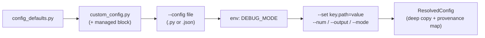

# Domain & Generation Console — Critical Review and Spec-Driven Implementation Plan

**Status:** Complete (Milestones M0–M8 100% Complete & Passing) · **Feature ID:** `004-domain-console` · **Supersedes:** "Complete System Overview: Interactive Domain Management Platform"

Legend: ✔ = verified by running code in a sandbox · (src) = read directly from the uploaded source · (unverified) = could not be checked with the files provided · (repo) = confirmed against the full repository by a second review.

> **Implementation Note (Complete):** Milestones M0 through M8 are fully implemented and verified passing (91/91 milestone tests pass in `tests/test_m[0-8]*.py` and `tests/test_nfr01_import_guard.py`). Note: running `pytest tests/test_m*.py` in bash matches non-milestone tests `test_metadata_persistence.py` and `test_multiprocessing_scaling.py` (a 104-worker stress test). Use `pytest tests/test_m[0-8]*.py tests/test_nfr01_import_guard.py` to run the milestone test suite directly.

---

## 0. Evidence base and blind spots

**Read in full:** `config_defaults.py`, `custom_config.py`, `loader.py`, `sampler.py`, `catalog.py`, `enums.py`, `schema.py`, `structural.py`, `versions.py`, `SCHEMA.md`, `requirements.txt`.
**Read selectively (grep + targeted ranges):** `generator.py` (imports, domain/weight selection L3640–3720, schema-version switch, effects dispatch, `main()` L4581–end), `tabular.py` (presets + domain sampling), `vegalite_backend.py` (domain tagging).
**Verified against the full repository (rev 1.1, repo):** every finding in §2.1 (B1–B7) and the flaws B4, B5, H2–H4 were re-confirmed. `testar.py` does **not** exist. Measured corpus baseline — use this for the M0 fixtures; the overview's 448 / 147 / 94 were stale:

| Manifest | Metrics | Titles | Pairs |
|---|---|---|---|
| `biomedical.yaml` | 122 | 57 | 40 |
| `business.yaml` | 124 | 73 | 24 |
| `common.yaml` | 91 (40 canonical independents + 51 histogram Y-labels) | 6 | 0 |
| `demographic.yaml` | 22 | 15 | 0 |
| `engineering.yaml` | 136 | 41 | 32 |
| **Total** | **495** | **192** | **96** |

The `common.yaml` 40/51 split is exactly the positional boundary behind B2. **Still unverified:** `tests/test_domain_manifests.py`, `themes.py`, `synth/semantics/__init__.py`.

---

## 1. Verdict

The overall shape — a headless engine with a thin `rich` shell, a pre-flight diff, atomic writes, one-way sync into the pipeline — is right. **As written, it would not work**, for three reasons:

1. **The generator ignores `custom_config.py`.** Any "edit settings" feature (including the new Generate menu) would silently have no effect until a config-resolution layer exists.
2. **`loader.py` assigns "legacy/canonical/histogram" membership by list position.** An import tool that appends rows will silently corrupt `HISTOGRAM_Y_LABELS` and the legacy catalogs.
3. **"New domain" touches far more than `sampler.py`.** At least nine hard-coded sites would silently substitute biomedical/business vocabulary for a new domain.

Two statements in the overview are also factually wrong against the code (stem format, `ordinal`). The plan below therefore inserts a **Phase 0 hardening** before any UI, and splits delivery so the **Generate + Settings console ships first** (it depends only on the config layer, not on the semantic refactor).

---

## 2. Critical review

### 2.1 Blockers

| ID | Finding (evidence) | Required change | Req |
|---|---|---|---|
| **B1** | `generator.py:93` does `from config_defaults import OCR_TRAINING_CONFIG as GENERATION_CONFIG`. `custom_config.py` is loaded only if `--config <path>` is passed (`main()`, ~L4596). The FR-023 docstring in `config_defaults.py` ("fallback when custom_config.py is absent") describes a precedence nothing implements. Worse: module-level `CHART_CLASS_MAPS` and dozens of `GENERATION_CONFIG.get('debug_mode')` reads (L394–600 and elsewhere) use defaults, and the `spawn` pool re-imports defaults in every worker, so even `--config` overrides are ignored on those paths. `main()` also mutates the shared dict (`cfg['num_images'] = …`). | Layered `config_loader`; thread the resolved cfg into workers via a pool `initializer`; deep-copy. | CFG-01, CFG-02 |
| **B2** | `loader.py` L194–202 assigns pools by index: `common idx < 40` → canonical, **else → `HISTOGRAM_Y_LABELS`**; `biomedical idx < 75`, `engineering idx < 103`, `business idx < 86` → legacy. Appending a "Year" metric to `common.yaml` makes it a histogram Y-label; deleting or reordering any earlier row shifts every boundary. The Import tool is exactly the thing that appends. | Replace positions with explicit `pools:` flags; one-time migration; golden-equality test. | SEM-03 |
| **B3** | "Decoupling" is scoped to `sampler.py` + one test. Hard-coded domain lists also exist in: `loader.py` L164 (order, cosmetic), L215 (`title_is_sci` derived from the tag names `biomedical/engineering/business`), L244 (pair `is_scientific=(cat in ("biomedical","engineering"))`), L262 (`domain_title_index` built for 4 domains only); `sampler.py` L25/41/169/231 (fallbacks, pools, whitelist); `tabular.py` L13 (`DOMAIN_PRESETS`), L272/274 (`rng.choice([...])`); `vegalite_backend.py` L774–778; `chart.py` heatmap domain mapping (~L3284–3315). Consequences for a new domain `aerospace`: sampler silently draws biomedical/business labels; `sample_domain_schema` silently returns **business** tables; its titles get `is_scientific=None` and leak into **both** scientific and business fallback pools (already true for `demographic` today); its pairs are marked non-scientific. | Make the manifest the single source of `is_scientific`; registry exposes `domains`; unknown domain raises instead of substituting; capability flags for tabular/heatmap. | SEM-01, 02, 04, 05, 07 |
| **B4** ✔ | The overview says stems come from `compute_concept_stem()` "regex-sanitized". That function returns **space-separated** text (`'plasma concentration'`), which fails the schema's `^[a-z0-9_]+$`. Also fails: `'résistance'`, `'δ temperature'`, `''` (from `"(%)"`), `'growth rate'`. | New `make_stem()` in the admin layer: NFKD ASCII-fold, non-alphanumerics → `_`, collapse, trim; empty result → reject the row. | ADM-03 |
| **B5** ✔ | The spreadsheet contract lists `ordinal` as a valid Scale Type "validated against ScaleType". `enums.py` has no `ordinal` (continuous, categorical, discrete_count, percentage, temporal). | Map `ordinal` → `categorical` with a warning. Do **not** extend the enum (every sampler pool would need re-review). | ADM-04 |
| **B6** | Cache semantics: (a) `_load_manifest_raw_data()` returns the cache whenever it is newer than the newest YAML (L94), so "Revalidate & Rebuild Cache" is a **no-op** unless a YAML was touched; (b) deleting/renaming a manifest doesn't change max mtime → stale cache; (c) `CACHE_FILE.write_text` (L116) is non-atomic while N spawned workers import the loader concurrently (reads fall back to YAML on a torn file, so no crash, but wasteful); (d) the module-level `registry` is stale in-process after the manager writes; (e) `glob("*.yaml")` ignores `.yml`, and two files with the same `domain_id` silently override each other. | `rebuild_cache(force=True)`, atomic tmp + `os.replace`, content fingerprint (names + sizes + mtimes) stored in the cache, manager uses a fresh `SemanticRegistry.load()`, duplicate `domain_id` is an error, `.yml` warns. | SEM-06 |
| **B7** | The overview writes new-domain weights into `config_defaults.py`. That file is the *fallback layer*; mixing user choices into it defeats the override design, and regenerating a hand-commented Python literal by regex or `pprint` is fragile (it has inline comments, e.g. `dataset_format`). | Persist user choices in a **managed override block** in `custom_config.py`. Edit defaults only in an explicit developer mode via AST patch with diff + `.bak`. | CFG-04, CFG-05 |

### 2.2 High

| ID | Finding | Required change | Req |
|---|---|---|---|
| **H1** | Tag invariant: `domain_title_index` and `title_is_sci` use `item.domain_tags` only, and `sampler._build_axis_pools` uses `dom in m.domain_tags` (no `\| {dom_id}` as the loader does elsewhere). If the spreadsheet's `Tags` column *replaces* `domain_tags`, the row becomes invisible to its own domain. | Manager always writes `domain_tags = [domain_id, *extra]`; schema validator enforces `domain_id in domain_tags`. | ADM-05, SEM-08 |
| **H2** ✔ | PyYAML round-trip drops comments and rewrites formatting (confirmed on a sample). Every import would produce a noisy whole-file diff and destroy curator notes. | `ruamel.yaml` round-trip mode (build-time dependency only). List order preserved (see B2). | ADM-08 |
| **H3** ✔ | Fuzzy threshold ≥ 85 on full labels floods the diff with legitimate unit variants: `Concentration (μM)/(nM)` 94.4, `Temperature (°C)/(K)` 90.3, `Revenue ($M)/($K)` 91.7, `Time (h)/(s)` 87.5 all trip it; the overview's example "91% match" is actually 87.0. | Classify by *(stem, unit)*: same stem + different unit = `UNIT-VARIANT` (info). Fuzzy-score the **unit-stripped** text with a configurable threshold (default 90, to be tuned with `audit`) → `SIMILAR` (warn). | ADM-06 |
| **H4** ✔ | Unicode: Windows/Excel input produces `µ` (U+00B5) while existing labels use `μ` (U+03BC); NFKC unifies them but also rewrites `m²→m2`, `s⁻¹→s−1`, `log₂→log2`, destroying display forms that appear in `structural.py`. | Dedup *key* = `casefold(NFKC(collapse_ws(label)))`; *stored* label = NFC + whitespace collapse + NBSP→space + U+00B5→U+03BC only. | ADM-02 |
| **H5** | `schema.py`: Pydantic v2 defaults to `extra="ignore"` so misspelled YAML keys vanish silently; `allowed_chart_types` isn't checked against `ALL_CHART_TYPES` (a typo means the title is never sampled); no within-manifest uniqueness; no `default_fallbacks`. | `ConfigDict(extra="forbid")`, enum-checked chart types, uniqueness validators, new optional fields. | SEM-08 |
| **H6** | Isolation: `loader.py` promises ≤ 50 ms cold start with zero pydantic. The tool adds `rich`, `openpyxl`, `rapidfuzz`, `ruamel.yaml`. `pandas` is unnecessary and harmful here (default NA handling turns cell values like `NA`/`N/A`/`null` into NaN). | Tools deps in `requirements-tools.txt`; code under `synth/semantics/admin/`; subprocess import-guard test. Use `openpyxl` + stdlib `csv`. | NFR-01 |
| **H7** | "Global label uniqueness" collides with real multi-domain metrics, and `metrics_by_label` is last-wins today, so the existing corpus may already violate it (unverifiable). A *Skipped* duplicate means the target domain never gains the metric. | Default policy for a cross-domain exact match is **Share** (add the target `domain_id` to the existing metric's `domain_tags`; `is_scientific` still follows the owning manifest — document it). Run `audit` first; enforce on new imports only. | ADM-07, ADM-12 |
| **H8** | `pytest.main()` in-process shares the interpreter with a stale `registry` and plugin autoload. | Fast in-process Pydantic + invariant gate before commit; full test run in a **subprocess**. | ADM-10 |
| **H9** | Weights: `random.choices` takes relative weights, so "normalize to 1.00" is cosmetic (keep for display), but all-zero/negative totals raise at runtime, and keys with no manifest (B3) misbehave. `scientific_ratio` lives in `bar_chart_config` (`generator.py:3647`) yet drives **every** chart type. | Validate; expose a top-level `scientific_ratio` with back-compat read of the old location. | CFG-03, CFG-07 |

### 2.3 Medium / Low

| ID | Finding | Req |
|---|---|---|
| **M1** | `SCHEMA.md` documents v1–v3.0, but **v4.0 is the default** (`versions.py`, `_use_schema_v4`); `config_defaults.py` has no `annotation_schema_version`. | CFG-06, DOC-01 |
| **M2** | Config keys read by the generator but absent from defaults: `use_parallel`, `strict`, `engine` (`matplotlib`/`vegalite`), `export_obb`, `export_labels_obb`, `save_svg`/`export_svg`, `vegalite_scale`, `theme`, `semantic_domain`, `synthetic_domain`, `annotation_schema_version`/`detailed_schema`, `debug_coords`, `label_angle`. Supported effects missing from defaults: `uneven_lighting`, `chromatic_aberration`, `pdf_document_context` (+ aliases `perspective_warp`, `non_rigid_mesh`, `mesh_warp`). The effect map is a local variable inside `apply_realism_effects` (L1690), so nothing can introspect it. | CFG-06, GEN-05 |
| **M3** | Run mechanics: no programmatic entry (`main()` parses argv); files are `chart_{i:05d}` (L4073) so a re-run into the same directory silently overwrites; the stats loop assumes those names (L4683); `min(os.cpu_count(), …)` (L4643) raises `TypeError` if `cpu_count()` is `None`; `debug_mode` redirects output to `test/` and then launches `testar.py --show` (L4715) — a script that **does not exist** (repo), so the interpreter exits 2 and every debug run ends in a caught `CalledProcessError` message (L4718–4719; not `FileNotFoundError`, which only fires for a missing interpreter); workers `print` per image, which corrupts a `rich.Live` display. | GEN-01…GEN-06 |
| **M4** | `sampler.py` docstring ("94 pairs", index ranges 0–39 / 40–54…) is stale and describes the positional model being removed. Measured corpus: 96 pairs (business has 24, not 22). | SEM-09 |
| **L1** | `STATIC_DOMAIN_FALLBACKS` and `HEATMAP_*` pools (`structural.py`) only cover scientific/business; new domains need an explicit decision (see §3.4). | SEM-05, SEM-07 |

### 2.4 What the overview got right (keep)

Headless-core + thin-shell split; pre-flight diff with a Pydantic gate; atomic write via temp + rename; title set-union; unordered pair de-dup; *Skip/Merge/Overwrite/Abort* policies; keeping runtime free of build-time deps.

---

## 3. Revised architecture

### 3.1 Layout

```text
config_loader.py             NEW  stdlib-only. Layered resolution + provenance + validate()
config_defaults.py                defaults only (+ newly documented keys)
custom_config.py                  user layer; tool-managed block between sentinels
generator.py                      main() → load_config() + run_generation(cfg); thin CLI
synth/semantics/
    loader.py sampler.py …        generalized in Phase 0 (SEM-*)
    admin/                   NEW  build-time only; never imported by runtime
        ingest.py normalize.py dedupe.py plan.py apply.py audit.py
        configspec.py configsvc.py runner.py
scripts/manage_domains.py    NEW  rich TUI + argparse subcommands (same engine)
requirements-tools.txt       NEW  rich, openpyxl, rapidfuzz, ruamel.yaml
```

### 3.2 Configuration precedence



`--no-custom` skips the second layer (used by the golden tests and "factory defaults" runs).

### 3.3 Manifest schema delta (additive; `manifest_version: 2`)

```yaml
domain_id: aerospace
display_name: Aerospace
is_scientific: true
default_weight: 0.10                       # used by "register domain" prompts
default_fallbacks: ["Altitude (m)", "Airspeed (knots)"]   # (x, y); required for new domains
capabilities: { tabular_preset: false, heatmap_pools: false }   # informational, see §3.4
metrics:
  - label: "Core Rotor Temp (°C)"
    scale_type: continuous
    role: dependent
    concept_stem: core_rotor_temp
    domain_tags: [aerospace]               # MUST contain domain_id
    pools: []                              # optional: legacy, canonical_independent, histogram_y
```

### 3.4 Capability matrix for a new domain (decision, not an accident)

| Consumer | Reads manifests? | New-domain behavior in v1 |
|---|---|---|
| `sample_chart_title/axis_pair/secondary_y/comparative_pair` | Yes | Fully supported after SEM-01…05 |
| Weights in `generator.py` | via cfg | Supported; a domain with **no weight is never sampled** → warn |
| `tabular.py` (`use_synthetic_data_engine`) | No — own `DOMAIN_PRESETS` | **Not supported**; raise `UnknownDomainError` instead of today's silent `business` substitution; wizard prints "synthetic engine: unavailable" |
| Heatmap label pools (`structural.py`) | No — scientific/business pools | Use the generic pool of the domain's `is_scientific` group; wizard states this |
| `vegalite_backend.py` | No | `is_scientific` taken from registry (SEM-07) |

Generating domain presets from manifests (marginals from `scale_type`) is deferred (§7, Q2).

---

## 4. Specification

Requirement IDs are stable; each has an acceptance test (AT). "Unit" = pytest unit, "Golden" = snapshot comparison against output captured **before** any change (M0).

### 4.1 Semantic runtime generalization (`SEM`)

| ID | Requirement | Acceptance test |
|---|---|---|
| SEM-01 | Registry exposes `registry.domains: Dict[str, DomainInfo]` (id, display_name, `is_scientific`, default_weight, fallbacks, capabilities). No module outside `tabular.py` presets contains a literal tuple of the four baseline domain ids. | AST lint test over `loader.py`/`sampler.py`. Fixture manifest in a temp dir via `SYNTH_DOMAINS_DIR` yields only that domain's vocabulary for all 6 Cartesian types × 2 orientations. |
| SEM-02 | `is_scientific` for metrics, titles and pairs derives from the owning manifest (`common` ⇒ `None`). Titles with mixed tags use the union of the tagged domains' flags. | Unit: fixture scientific domain never appears in the business fallback pool. |
| SEM-03 | Pool membership uses explicit `pools:`; positional slicing is removed after migration. Migration script sets flags from the *current* indices. | **Golden:** `LEGACY_METRICS_CATALOG`, `CANONICAL_INDEPENDENT_METRICS`, `HISTOGRAM_Y_LABELS`, `LEGACY_METRIC_BY_LABEL`, legacy pairs identical (same labels, same order) before vs. after. Unit: appending a metric to `common.yaml` leaves `HISTOGRAM_Y_LABELS` unchanged. |
| SEM-04 | Unknown `domain` raises `UnknownDomainError` in sampler functions (no remap to biomedical/business, no fallback to all pairs). The generator pre-validates weight keys so this cannot occur mid-run. | Unit per function. |
| SEM-05 | `default_fallbacks` read from manifests; if absent, derive (first independent + first dependent metric of the domain, else `common` independent + domain dependent). `STATIC_DOMAIN_FALLBACKS` remains only as legacy values for the four base domains. | Unit: a dependent-only domain still returns a valid pair for bar/line/area. |
| SEM-06 | `rebuild_cache(force=True)`; atomic cache write (tmp + `os.replace`); fingerprint (names + sizes + `mtime_ns`) stored in cache; duplicate `domain_id` ⇒ error; `.yml` ⇒ warning; `SemanticRegistry.load(raw=None)` accepts an in-memory dict (used to validate candidates before writing). | Unit: delete a manifest ⇒ cache invalidated; concurrent loaders (8 processes) never raise. |
| SEM-07 | `vegalite_backend` and `tabular.sample_domain_schema` consult the registry; no silent substitution. | Unit: `sample_domain_schema("aerospace")` raises with a clear message; vegalite `is_scientific` equals registry flag. |
| SEM-08 | `schema.py`: `extra="forbid"`; chart types ⊂ `ALL_CHART_TYPES`; `domain_id ∈ domain_tags` for every metric/title; unique labels per manifest; optional `default_fallbacks`, `capabilities`, `pools`, `manifest_version`. | Unit: each violation produces a located error (file, entry index, field). |
| SEM-09 | Fix stale docstrings in `sampler.py`. | Doc review. |

### 4.2 Configuration layer (`CFG`)

| ID | Requirement | Acceptance test |
|---|---|---|
| CFG-01 | `config_loader.load_config(path=None, overrides=None, use_custom=True, env=os.environ) -> ResolvedConfig` (stdlib only): precedence per §3.2; returns a deep copy; `.provenance[path] ∈ {default, custom, file, env, cli}`. A missing `custom_config.py` is not an error; a *broken* one is (clear message, exit 2). | Unit per layer; mutation of the result never changes `config_defaults`. |
| CFG-02 | `generator.py` uses `load_config`; `ProcessPoolExecutor(initializer=_init_worker, initargs=(cfg,))` sets the active cfg in each worker; `CHART_CLASS_MAPS` and debug reads use it. | **Golden:** with `--no-custom` and fixed seed, label files are byte-identical to pre-change output. Integration: `debug_mode=True` set only in `custom_config.py` produces debug lines from worker processes. |
| CFG-03 | `configspec.py`: declarative table (path, type, range/enum, doc, group, `danger` flag) + `validate(cfg) -> List[Issue(level, path, msg)]`. Rules include: ≥ 1 enabled chart type with weight > 0 (generator otherwise silently falls back to uniform weights); weights ≥ 0; probabilities ∈ [0, 1]; `dataset_format` enum; subdomain weight keys ⊂ the manifest domain list **and** group matches the domain's `is_scientific` (read through a small read-only `list_domains()` helper over `_load_manifest_raw_data()`, so Release A does not depend on SEM-01; `registry.domains` replaces it in M5); each subdomain group total > 0 when its ratio > 0; `synthetic_domain`/`semantic_domain` ∈ the same domain list; `heatmap_validation.min_cell_coverage` ∈ [0, 1]; effect names ∈ effect registry; `num_images` ≥ 1; `engine` ∈ {matplotlib, vegalite}. | Unit: one failing and one passing case per rule. |
| CFG-04 | Settings persist to `custom_config.py` between `# >>> managed by manage_domains — do not edit >>>` and `# <<<` sentinels, emitted as leaf assignments for **only the differences from defaults**. Everything outside the block is untouched. | Unit: apply → reload → `diff(defaults, resolved)` equals the edit set; bytes outside the block unchanged; re-apply is idempotent. |
| CFG-05 | Developer mode may patch `config_defaults.py`: locate the key's literal via `ast`, replace only that source span, show unified diff, write `.bak`, re-import in a subprocess, roll back on failure. If the literal can't be located, offer `$EDITOR`. | Unit on a fixture copy of `config_defaults.py` (comments preserved). |
| CFG-06 | Add every key listed in M2 to `config_defaults.py` with documented defaults (`annotation_schema_version="v4.0"`, `use_parallel=True`, `strict=False`, `engine="matplotlib"`, …). No behavior change at defaults. | Golden (as CFG-02). |
| CFG-07 | Top-level `scientific_ratio`; the loader still honors `bar_chart_config.scientific_ratio` with a deprecation note when the new key is absent. | Unit. |

### 4.3 Domain admin engine (`ADM`, headless, no UI imports)

| ID | Requirement | Acceptance test |
|---|---|---|
| ADM-01 | Ingest `.xlsx` (openpyxl, `data_only=True`, read-only) and `.csv` (BOM-tolerant; delimiter sniffing for `,` `;` `\t`; UTF-8 then cp1252 fallback). Sheets matched by case/space-insensitive name; headers matched case/space/underscore-insensitively with documented synonyms; hidden sheets and fully blank rows ignored; every issue carries sheet + row number; caps: ≤ 20 000 rows, ≤ 10 MB. | Unit with fixtures for each quirk; Excel `#N/A` cells ⇒ row error. |
| ADM-02 | Normalization per H4 (dedup key vs. stored label). | Unit: `µM` and `μM` collide; `kg/m²` stored unchanged. |
| ADM-03 | `make_stem(label)` per B4; stem collisions inside the domain are classified (see ADM-06), never auto-renamed. | Unit: table of labels → expected stems; empty ⇒ rejected. |
| ADM-04 | Enum handling: Scale Type default `continuous`, Axis Role default `dependent`; `ordinal` → `categorical` + warning; unknown value ⇒ row error listing valid values. | Unit. |
| ADM-05 | Titles: blank chart types ⇒ `CARTESIAN_CHART_TYPES`; values validated; `Tags` appended after `domain_id`; same title in the domain ⇒ set-union of chart types and tags. Pairs: control ≠ treatment (after normalization); unordered de-dup. | Unit. |
| ADM-06 | Classification of each metric row: `NEW`, `DUPLICATE` (same domain, exact key), `SHARED` (exact key in another domain), `UNIT-VARIANT` (same stem, different unit), `SIMILAR` (unit-stripped fuzzy ≥ threshold), `INVALID`. Only `INVALID` is dropped unconditionally. | Unit with the §2.2-H3 label table: none of the legitimate unit variants is `SIMILAR`; the "Presure" typo is. |
| ADM-07 | Collision policy `--on-collision skip, merge, overwrite, abort`. Defaults: same-domain exact ⇒ skip; cross-domain exact ⇒ share. `overwrite` is same-domain only and keeps the entry's list position and `pools`. | Unit per policy; position preserved. |
| ADM-08 | YAML read/write via `ruamel.yaml` round-trip; new entries appended at the end of their list; comments and key order preserved; `yaml.safe_load` semantics only (no arbitrary tags). | Unit: import into a commented fixture ⇒ diff contains only appended entries. |
| ADM-09 | `plan = build_plan(source, domain, policy)` is pure (no I/O besides reading) and serializable (`--report plan.json`); `apply(plan)` is the only writer. | Unit: plan is deterministic and re-runnable. |
| ADM-10 | `apply` is transactional: lock file (`O_EXCL`, PID, stale-lock detection) → snapshot to `domains/.backups/<UTC-ts>/` → build candidate manifests in memory → Pydantic validate → compile a candidate registry and check invariants (SEM-03 golden subset; no empty x/y pool for any Cartesian type in the touched domain) → write each file via tmp + fsync + `os.replace` → force cache rebuild → optional `--verify` subprocess `python -m pytest -q tests/test_domain_manifests.py` → on any failure restore the snapshot. `restore --list/--to <ts>` exposed. | Fault-injection test: raise at each step ⇒ tree byte-identical to before. |
| ADM-11 | New-domain wizard creates the manifest skeleton (incl. `default_fallbacks`), offers weight registration into the **custom** layer (CFG-04, pre-filled from `default_weight`, rebalanced for display), and offers a multi-select of `common.yaml` independent metrics (default selection: those already tagged for ≥ 3 domains, e.g. `Date`, `Timestamp`). Selected metrics get the new `domain_id` appended to their `domain_tags` using the `SHARED` operation (ADM-07). If none is selected the wizard warns that bar/line/area charts will use static fallbacks. | Integration: create `aerospace` ⇒ `load_config` shows its weight ⇒ validator passes ⇒ for bar, line and area × both orientations `sample_axis_pair` returns domain-sourced labels, not the static fallback pair. |
| ADM-12 | `audit` command (read-only): duplicate labels across manifests, stem collisions, tag-invariant violations, positional-pool leftovers, near-duplicate labels, and **degenerate pools** — every (domain × Cartesian type × orientation) whose x- or y-pool is empty and therefore silently uses the static fallback. Non-zero exit with `--strict`. | Unit on fixtures; run once on the real corpus before enabling enforcement (the `Date` example in `common.yaml` lists only biomedical/engineering/business, so check whether `demographic` already hits fallbacks). |
| ADM-13 | Test fixture: `EXPECTED_DOMAINS.issubset(loaded)`; add a test that every manifest on disk validates and that all tool-written files round-trip through `load → write → load` unchanged. | CI. |
| ADM-14 | `template` subcommand writes `domain_template.xlsx` (openpyxl) with the three sheets and exact headers from the spreadsheet contract, one example row each, and `DataValidation` dropdowns for *Scale Type* (the five enum values only — `ordinal` is accepted when typed but not offered) and *Axis Role*. *Allowed Chart Types* is a free-text comma list (Excel cannot multi-select), with the valid values in a header note. | Unit: generated workbook re-ingests with zero issues; dropdown lists equal `ScaleType`/`AxisRole` members. |

### 4.4 Generation runner and generator CLI (`GEN`)

| ID | Requirement | Acceptance test |
|---|---|---|
| GEN-01 | Refactor `main()` into `load_config()` + `run_generation(cfg, progress=None) -> RunSummary` + thin argparse wrapper. Existing flags (`--config --num --output --mode --strict`) unchanged. | Golden: same output as before for the same seed. |
| GEN-02 | New flags: `--no-custom`, `--config` accepting `.json` as well as `.py`, `--set key.path=JSON` (repeatable), `--progress-jsonl PATH` (events `image_done {i, ok, secs}`), `--log-file PATH` (worker stdout redirected), `--validate-only` (resolve + CFG-03 validation, no rendering), `--start-index N`. | Unit for parsing; `--validate-only` exits 0/2 correctly. |
| GEN-03 | Exit codes: 0 ok · 1 strict failure · 2 invalid config · 3 output-dir conflict. | Subprocess test per code. |
| GEN-04 | Writes `run_manifest.json` into the output dir: resolved config + hash, seed, schema/dataset versions, manifest-registry fingerprint, counts, failed indices, wall time, git revision if available. | Unit: two runs with the same inputs ⇒ same config hash and dataset-content hash. |
| GEN-05 | Hoist the effect map to module-level `EFFECT_REGISTRY` (name → callable, aliases marked) so the UI/validator can enumerate effects and their params. | Unit: every effect named in defaults is registered. |
| GEN-06 | Robustness: `os.cpu_count() or 1`; stats loop reads the actual label files (honors `--start-index`); `debug_mode` launches the debug viewer only if the script file exists **and** `--show-debug` is passed (never from the TUI); otherwise the dead `testar.py` call is skipped silently. | Unit. |
| GEN-07 | TUI runner launches `python generator.py …` as a **subprocess** (isolation from the shared-dict mutation and `spawn`/Agg state), shows a `rich.progress` bar from the JSONL stream, writes worker output to `<out>/run.log`, tails the last 40 lines on failure, and prints the summary table from `run_manifest.json`. | Integration with `-n 3`. |

### 4.5 Terminal UI (`TUI`)

| ID | Requirement | Acceptance test |
|---|---|---|
| TUI-01 | Every menu action has a headless subcommand: `audit`, `import`, `new-domain`, `rebuild`, `restore`, `config show/set/validate`, `generate`, `template`. TUI is a thin layer over the same functions. Non-TTY ⇒ no prompts, plain text; `NO_COLOR` and `--ascii` (no emoji) honored. | Console-recording tests; subcommand parity test. |
| TUI-02 | Menu as in §5. Header shows manifest/cache health, active config sources (is `custom_config.py` present? how many overrides?), generator readiness (deps importable), last run. | Snapshot tests of rendered panels. |
| TUI-03 | Pre-flight diff table (§5.3) with statuses from ADM-06, per-status counts, "export report", `--yes` for automation, and a final y/N before `apply`. | Snapshot + prompt-monkeypatch tests. |
| TUI-04 | Generate hub and Settings editor (§5.2, §5.4) with validation errors displayed inline (CFG-03) and **Run** disabled while errors exist. | Prompt-script tests. |
| TUI-05 | Ctrl-C at any prompt returns to the menu without side effects; during a run it terminates the subprocess tree and keeps partial output with a note in `run_manifest.json` (`"interrupted": true`). | Manual + subprocess test. |

### 4.6 Non-functional (`NFR`) and docs

| ID | Requirement | Acceptance test |
|---|---|---|
| NFR-01 | Runtime isolation: `import synth.semantics` must not import `pydantic`, `rapidfuzz`, `openpyxl`, `rich`, `ruamel`, or `synth.semantics.admin`; cold import ≤ 50 ms. | Subprocess test checking `sys.modules`; `-X importtime` budget test. |
| NFR-02 | Determinism: same seed + config + manifests ⇒ same dataset. | Hash test over two runs. |
| NFR-03 | Crash safety: no state in which a manifest is half-written (ADM-10). | Fault injection. |
| NFR-04 | Security: `yaml` safe loading only; no `eval`/`exec` on spreadsheet content; `custom_config.py` is trusted code (documented) while `.json` configs are data-only. | Review + unit. |
| NFR-05 | Portability: Windows/macOS/Linux path handling, UTF-8 output, spawn-safe entry points. | CI matrix (at least Linux + Windows). |
| DOC-01 | Update `SCHEMA.md` with v4.0; add `docs/domain-console.md` (spreadsheet contract incl. the corrected `ordinal` row, collision policies, config layers, recovery procedure). | Review. |

---

## 5. Terminal experience

### 5.1 Main menu (current options keep their numbers; Exit becomes `0`)

```text
╭──────────────────── Synthetic Chart Studio ─────────────────────╮
│  Domains: biomedical, business, common, demographic, engineering │
│  Metrics: <n> | Titles: <n> | Pairs: <n>   Cache: [OK]           │
│  Config:  defaults ← custom_config.py (3 overrides)              │
│  Generator: ready (matplotlib)   Last run: 200 imgs, 0 failed    │
╰──────────────────────────────────────────────────────────────────╯
  [1] Inspect domains & statistics
  [2] Import & deduplicate spreadsheet (.xlsx / .csv)
  [3] Create new domain
  [4] Sampling weights (domains, chart types, scenarios)
  [5] Validate manifests & rebuild cache
  [6] Generate charts & edit generation settings      ← NEW
  [0] Exit
```

Change vs. the overview: *Adjust Sampling Weights & Fallbacks (config_defaults.py)* becomes **[4] Sampling weights** and writes to the custom layer (B7); *Revalidate* is [5] and actually forces a rebuild (B6).

### 5.2 `[6] Generate charts & edit generation settings`

```text
  [a] Generate charts…            number, format, output dir, seed, engine, workers
  [b] Smoke test (3 charts → temp dir, then open summary)
  [c] Edit settings (guided)      groups below; saved to custom_config.py
  [d] Open a config file in $EDITOR   custom_config.py / config_defaults.py (dev mode)
  [e] Show effective config       every key with its source: default / custom / cli
  [f] Validate config             CFG-03 report
  [g] Recent runs                 from run_manifest.json files
  [b] Back
```

**Run flow (`[a]`)**

1. Prompt: *number of charts* (default from config), *dataset format* (detection / classification / multi_chart_detection), *output dir*, *seed* (blank ⇒ config value), *engine*, *workers*. Each prompt shows the current effective value and its source.
2. Validate (CFG-03). Errors block; warnings are listed (e.g. "domain `aerospace` has no weight — it will never be sampled").
3. Output-dir guard: if non-empty ⇒ choose **new timestamped dir** (default) / overwrite (typed confirmation) / append (`--start-index`).
4. Time estimate from the last smoke test or run (`secs/img ÷ workers`); confirm if the estimate exceeds ~10 minutes.
5. Run (GEN-07) with progress; on completion show per-class instance counts, failures, schema version, `run_manifest.json` path.

**Guided settings groups (`[c]`)**: *Run basics* · *Chart mix* (per-type enabled/weight, scenario weights) · *Domains* (scientific ratio, subdomain weights, forced `semantic_domain`) · *Per-chart options* (bar, line, scatter, box, histogram, pie, heatmap, area) · *Realism effects* (probability + params, listed from `EFFECT_REGISTRY`) · *Output & schema* (annotation schema, OBB export, legacy JSON, SVG export) · *Multi-chart layout* · *Advanced* (parallelism, strict, debug — debug shows a warning that it redirects output to `test/`).

Each edit shows `old → new`, validates immediately, and offers a *Save to custom_config.py* step with a diff. *Reset key to default* removes the override.

### 5.3 Import pre-flight table (revised statuses)

```text
Status        Entity   Label / Title                 Details
───────────────────────────────────────────────────────────────────────────────
NEW           Metric   Turbine Vibration (mm/s)      continuous | dependent | turbine_vibration
SHARED        Metric   Temperature (°C)              exists in business → adds tag 'engineering'
UNIT-VARIANT  Metric   Core Rotor Temp (K)           same stem as 'Core Rotor Temp (°C)' (by design)
DUPLICATE     Metric   Exhaust Temperature (°C)      exact match in engineering.yaml (skip)
SIMILAR       Metric   Vibration Amplitude (mm/s)    unit-stripped match with 'Vibration Amp' (92)
INVALID       Pair     Vehicle → Vehicle             control equals treatment (row 14)
───────────────────────────────────────────────────────────────────────────────
Summary: 18 new · 3 shared · 2 unit variants · 2 duplicates · 1 similar · 1 invalid
Backup will be written to synth/semantics/domains/.backups/<ts>/ — commit? [y/N]
```

(Rows are illustrative; counts come from the actual plan.)

### 5.4 Weights screen

Two groups (scientific / non-scientific, assigned by each manifest's `is_scientific`). Numeric entry per domain, live normalized-percentage bars, validation that each group's total > 0, and a hint for any domain with a manifest but no weight.

---

## 6. Delivery plan

Effort assumes one developer who knows the codebase: **S** ≤ 1 day · **M** 2–4 days · **L** 5–8 days.

| Milestone | Scope | Depends on | Effort | Status | Exit criteria |
|---|---|---|---|---|---|
| **M0 Safety net** | Capture characterization fixtures *before touching code*: dump current catalogs (all `registry` tuples/dicts) and a 20-image seeded generation hash (labels + `_detailed.json`). Add the import-guard test (NFR-01) in report-only mode. | — | S | **COMPLETE** ✔ (2/2 passing in `tests/test_m0_goldens.py`) | Fixtures committed; tests green on current code |
| **M1 Config layer** | CFG-01/02/06/07, GEN-01/05/06 (`main()` refactor, worker initializer, new defaults) | M0 | M | **COMPLETE** ✔ (8/8 passing in `tests/test_m1_config_layer.py`) | Goldens identical; `custom_config.py` demonstrably takes effect |
| **M2 Settings service** | CFG-03/04/05 (`configspec`, managed block, dev-mode patch) + read-only `list_domains()` helper | M1 | M | **COMPLETE** ✔ (14/14 passing in `tests/test_m2_settings_service.py`) | Round-trip tests green |
| **M3 Generation runner** | GEN-02/03/04/07 | M1 | M | **COMPLETE** ✔ (5/5 passing in `tests/test_m3_generation_runner.py`) | `generate -n 3` end-to-end incl. JSONL progress, manifest, exit codes |
| **M4 TUI — Generate/Settings** | TUI-01/02/04/05 (menu `[6]`, hub, editor, weights) | M2, M3 | M | **COMPLETE** ✔ (12/12 passing in `tests/test_m4_tui_generate_settings.py`) | **Release A Complete**: users can configure and run generation from the menu |
| **M5 Semantic generalization** | SEM-01…09, pool migration, `SYNTH_DOMAINS_DIR` | M0 | L | **COMPLETE** ✔ (19/19 passing in `tests/test_m5_semantic_generalization.py`) | Goldens identical; fixture-domain test passes for all chart types |
| **M6 Admin engine** | ADM-01…13 + `audit` run on the real corpus | M5 | L | **COMPLETE** ✔ (11/11 passing in `tests/test_m6_manifest_admin_engine.py`) | Fault-injection and round-trip tests green; audit report reviewed |
| **M7 TUI — Domain management** | TUI-03 and menu `[1]–[5]` wiring | M6 | M | **COMPLETE** ✔ (12/12 passing in `tests/test_m7_tui_domain_management.py`) | **Release B Complete**: interactive and headless domain management operational |
| **M8 Docs & hardening** | DOC-01, CI matrix, Windows pass | all | S | **COMPLETE** ✔ (3/3 passing in `tests/test_m8_hardening.py` & `test_nfr01_import_guard.py`) | Definition of done met |

M1 ∥ M5 can proceed in parallel. Release A (M0–M4) needs no semantic *refactor* and writes nothing to the manifests; its only coupling is the read-only `list_domains()` helper, so it can ship first.

### Risks

| Risk | Mitigation |
|---|---|
| Pool migration changes sampling behavior subtly | Golden equality on all legacy catalogs *and* on a seeded generation hash (M0) |
| `ruamel.yaml` output differs from current style on first write | One-time normalization commit reviewed separately; ADM-08 test ensures later diffs are append-only |
| Existing corpus already violates global uniqueness | `audit` first (ADM-12); enforcement only on new imports; fixes in a separate commit |
| Generator refactor regresses a 4.7k-line file | Touch only imports + `main()`; goldens before/after; no changes to chart code paths |
| Users edit the managed block by hand | Sentinel comment; the tool regenerates the block and warns if it was modified out-of-band (hash comment) |
| Tabular engine unavailable for new domains | Explicit capability message (§3.4) rather than silent substitution |

### Definition of done

All acceptance tests pass in CI on Linux and Windows; goldens unchanged; NFR-01 enforced (no longer report-only); adding a domain through the TUI and generating 20 charts produces `semantic_domain` = that domain with axes/titles from its manifest; `SCHEMA.md` documents v4.0; `audit` on the real corpus is clean or has a tracked remediation list.

---

## 7. Decisions

| # | Question | Status | Decision |
|---|---|---|---|
| Q1 | Is `custom_config.py` the per-user layer, auto-loaded? | Confirmed (repo) | Yes — auto-loaded after defaults; `--no-custom` opts out (CFG-01) |
| Q2 | Synthetic data engine for new domains in v1? | Confirmed | No — explicit "unavailable" + `UnknownDomainError`; manifest-driven presets are a follow-up feature |
| Q3 | `ruamel.yaml` as a build-time dependency? | Confirmed | Yes — `requirements-tools.txt` only |
| Q4 | How do `common` independent metrics (Date, Timestamp, …) reach a new domain? | **Resolved** (repo) | See below |
| Q5 | Generate `.xlsx` templates? | Confirmed | Yes — ADM-14, including dropdown validation |

**Q4 ground truth (repo).** The 40 canonical independents in `common.yaml` carry explicit `domain_tags` (e.g. `Date` → biomedical, engineering, business) and `sampler._build_axis_pools` selects with `dom in m.domain_tags`, so a new domain never sees them unless it is tagged.

**Decision: tag, don't inherit implicitly.** The reviewer's alternative — make every `common` independent available to all Cartesian domains inside `_build_axis_pools` — is rejected for v1 because it (a) silently changes the pools of the four existing domains wherever the curated tags currently exclude them, which changes seeded output and breaks the M0 goldens (SEM-03, NFR-02); (b) discards the curation that the per-metric tags encode; and (c) hides the relationship in code instead of the manifests. Instead, the new-domain wizard (ADM-11) appends the new `domain_id` to selected `common` metrics through the same `SHARED` operation used for imports, and `audit` (ADM-12) reports any domain left with an empty pool. Existing domains are untouched; the data stays declarative and diffable. If the audit later shows several domains with the same gap, an opt-in manifest flag can be added as a separate, golden-reviewed change.
