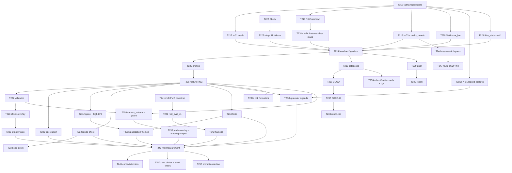

# Implementation Plan: Domain-Gap Closure

**Spec**: `specs/005-domain-gap-closure/spec.md` · **Evidence**: `research.md` · **Tasks**: `tasks.md`
**Branch**: `005-domain-gap-closure` · **Status**: Phase 0 & Phase 1 Complete (Phase 1 Gate Passed)

## Summary

Ship diversity improvements **safely**: first repair the labels and the baseline (Phase 0), then add a profile mechanism so new behaviour cannot silently change existing datasets (Phase 1), then interoperable export and a measurement loop (Phase 2), and only then the larger context/layout/chart-type work, with the sim-to-real harness deciding what becomes default (Phase 3). Nothing in the plan edits a default value that consumes randomness.

## Technical Context

| Item | Value |
|---|---|
| Language / runtime | Python 3 (CI as in `.github/workflows/ci.yml`); research ran on matplotlib 3.10.8 |
| Unified deps | core, vector graphics, manifests/Pydantic, tools, and pytest in `requirements.txt` |
| New optional deps | `requirements-eval.txt` (small detector for the harness); `pycocotools` optional for validation |
| Tests | `pytest tests/ --ignore=tests/regression` — **207 pass / 11 fail / 1 skip before any change** (224 s) |
| Output contract | YOLO txt (+OBB/pose/seg), schema v4.0 `_detailed.json`; spec 001 `transform_steps` compensation |
| Perf reference | 24 single-chart images in ≈ 9 s, effects off, single process (research sandbox) |
| Config layering | defaults → `custom_config.py` → `--config` → `--set` with provenance (`config_loader.py`) |

## Inherited-Constraints Check

| Constraint | Source | How this plan complies |
|---|---|---|
| Geometric effects transform each OBB corner through the exact same per-point mapping; never re-derive an AABB as primary geometry | spec 001 FR-002 | New `resize` effect adds a `("scale", …)` step handled by the same compensation code (T232); no new bbox re-derivation |
| Canvas-changing steps record canvas size at the step | spec 001 FR-021 | `scale` carries `new_w,new_h`; verified that `pdf_document_context` already complies (research D2-10) |
| Rotated text OBB from unrotated font metrics + rotation/anchor | spec 001 FR-025 (`get_text_obb_and_bbox`, `generator.py:271`) | Keep default `rotation_mode`; choose `ha` by sign (T230); OBB-vs-ink test per angle×`ha` |
| OBB convex and clockwise | spec 001 FR-026 (`canonicalize_and_validate_obb`, `generator.py:214`) | Unchanged; COCO-O reuses it |
| OBB for every annotated element | spec 001 FR-001 | Measured gap (36%, N-05) → COCO-O marks `obb_derived`; closing the gap is **not** in scope here |
| Goldens must not depend on cross-OS pixel hashes | spec 001 FR-031 | Goldens are label/JSON hashes + environment fingerprint (T224) |
| Seeded 20-image default-config hash is stable | `tests/test_m0_goldens.py` | Legacy path draws nothing new (FR-082); baseline-2 regenerated once, after fixes (T224) |
| No heavy imports at startup | `tests/test_nfr01_import_guard.py` | Fonts/evaluators lazy; new modules import light deps only |
| Schema evolves additively | `docs/SCHEMA.md` | v4.0 → v4.1 only for fields present in baseline-2; later fields omitted when empty (FR-108) |
| Every key in `realism_effects` costs one global RNG draw | `generator.py:1823`, research E12 | `canvas_reframe` is registry-only in legacy and configured only in the profile; its gate uses the feature RNG (FR-111) |
| Canvas-changing effects use translate-only compensation | spec 001 FR-021, `generator.py:1835` | `canvas_reframe` reuses the existing branch; geometry guard clamped to the canvas (FR-110) |

## Project Structure (new / changed)

```text
profiles/{legacy,domain_gap_v1}.json        # config overlays (FR-083, FR-086)
assets/fonts/{*.ttf,LICENSES/,manifest.json}# bundled, glyph-checked (FR-089)
categories_v1.json                          # append-only registry (FR-094)
calibration/ink_ratio_v1.json               # per-class thresholds (FR-104)
feature_rng.py                              # (seed, idx, feature) -> random.Random (FR-082)
font_registry.py                            # deterministic font registration + coverage check
coco_export.py                              # coco + coco-o from v4.0 records (FR-095)
classification_export.py                    # imagenet tree + manifest for classifier (FR-115)
scripts/{audit_annotations,dataset_report,fetch_real_eval,eval_sim2real,generate_backgrounds}.py
tests/test_p5_*.py  tests/golden/*.json     # baseline defects, profiles, effects, ticks, fonts, coco, audit
requirements.txt  requirements-eval.txt
specs/005-domain-gap-closure/research/repro_005.py
# changed: generator.py (N-01..N-04, N-06, N-14, N-16, resize/high-DPI, legend extractor, canvas reframe),
#          chart.py (ncols fix N-15, rotation, typography scale, tick formatters, publication themes),
#          effects.py (resize, uneven_lighting range, context regions, canvas_reframe),
#          config_defaults.py (magnitude 0.5->0.08 only), config_loader.py (profiles, validation),
#          detailed.py (filter_stats, ignored, context, legend_elements), versions.py, docs/SCHEMA.md
```

## Phased Roadmap

### Phase 0 [COMPLETE] — Make the baseline trustworthy (blocks everything) — T216–T224
Entry: none. Work: failing reproducers first (spec-driven), then fixes N-01…N-04, hidden twin-axis ghost labels (N-20), line/area class map alignment (N-14, T218b), legend `ncols` fix (N-15, T220b; dormant, non-blocking), filter accounting (N-06), CI/env (N-07), triage the 13–14 baseline failures (re-baseline 50 ms startup latency to 150 ms for 6× registry, fix registry golden lower bounds, isolate catalog expansion title duplicates), regenerate **baseline-2** goldens.
**Exit gate**: SC-002 sweep clean; `unknown` = 0; `error_bar` > 0; line/area class IDs aligned; hidden axes produce 0 ghost labels; all visible axes annotated; suite green or strict-xfail; baseline-2 committed.

### Phase 1 [COMPLETE] — Profiles + the changes that survived verification — T225–T234c, T254–T255
Entry: Phase 0 exit. Work: profile loader and feature-scoped RNG; config validation; bounded effects; effects-integrity gate; sign-correct tick rotation; figsize/aspect + typography scale; native high-DPI rendering for target ≥ 1200 px (FR-085); publication themes wiring (T231b); `resize` effect; resolution-aware size policy; bundled fonts; granular legend extraction and multi-series legends (T234b); tick formatters (T234c); canvas reframe with content guard (T254) and its profile/ordering/report integration (T255); publication themes need the bundled-font aliases first (T234 → T231b).
**Exit gate**: Scenario 1 (legacy byte-identical), Scenarios 3, 6 and 8 pass; SC-004…SC-007, SC-011, SC-012 met.

### Phase 2 [NEXT] — Interoperability, Classification, and Measurement — T235–T243
Entry: Phase 1 exit (COCO needs stable classes; the harness needs a profile to compare). Work: category registry (including granular legend and clutter classes), COCO/COCO-O export, round-trip tests; classification export mode + open-set background generation (T236b); class-aware audit; diversity report; `real_eval_v1` bootstrapped from UB PMC (T241b) + runner; first measurement.
**Exit gate**: Scenario 7; SC-008, SC-009, SC-010, SC-013, SC-014; decision record #1 (is `domain_gap_v1` promoted?).

### Phase 3 — Domain-gap closure — T244–T253
Entry: Phase 2 exit. Work: context regions and variants (measurement-gated labeling decision); asymmetric layouts; `multi_chart_detection` v4.0 emission; pie/heatmap enablement; violin/strip; Vega-Lite area + explicit errors + engine mix; free-text clutter and panel labels (T250b); decals; promotion review and docs.
**Exit gate**: SC-001…SC-014 all green; promotion decision recorded.

### Dependency graph



### Hard ordering constraints
- **OC-1**: T219 (annotate all axes) and the per-axis dedup fix land **in one commit** — fixing only the loop activates the row-blind dedup (research D2-04). Crucially, T219 MUST also gate tick label and axis title extraction on `ax.xaxis.get_visible()` and `ax.yaxis.get_visible()` to prevent phantom axis annotations on hidden twin axes (N-20).
- **OC-2**: baseline-2 goldens (T224) are generated **after** every output-changing Phase 0 fix (including the T218b line/area map fix and N-20), **before** any Phase 1 code.
- **OC-3**: No new `random.*` call on the legacy path; new features use `feature_rng` only (FR-082). Derive seeds with `zlib.crc32`/`hashlib` — **not** Python `hash()` (randomized per process by `PYTHONHASHSEED`).
- **OC-4**: Category registry and class maps are **append-only**; a test asserts every `class_name` in `CHART_CLASS_MAPS`, granular legend elements, clutter classes, and background class is registered.
- **OC-5**: COCO must be built after N-02 and N-14 are fixed, or `unknown` and conflicting class IDs leak into categories.
- **OC-6**: Asymmetric layouts (T246) only after T219.
- **OC-7**: Nothing becomes a default (T253) without a T243-style measurement and a decision record.
- **OC-8**: T218b (line/area class map alignment) MUST land before baseline-2 (T224) and before CategoryRegistry (T235). T220b is dormant (line/area legends carry ≤ 4 series, so no current output depends on it) and need only precede T234b.
- **OC-10**: `canvas_reframe` runs after all geometric effects and before `resize`, takes its content guard from `apply_realism_effects`, and never appears in `DEFAULT_CONFIG` (E12, E13).
- **OC-9**: Granular legend elements in `_detailed.json` and COCO MUST NOT alter standard monolithic `legend` box in YOLO `labels/*.txt` unless opt-in profile is specified.

## Migration and Compatibility

- Phase 0 **does** change legacy output (labels for line/area charts gain correct class names; composites gain subplot-2…N annotations; error bars appear; `filter_stats` added). This is intentional, announced in a changelog entry, and frozen as baseline-2.
- From baseline-2 on, `legacy` is byte-stable; every new field is omitted when not applicable.
- `perspective.magnitude` default 0.5 → 0.08 is output-neutral (`p=0`).
- Vega-Lite's silent scatter fallback becomes an explicit error — documented, with engine-aware weights so default runs do not hit it.

## Testing Strategy

| Layer | What | Where |
|---|---|---|
| Reproducers | One failing test per defect N-01…N-04, N-06, N-14, N-15 written **before** the fix | `tests/test_p5_baseline_defects.py` |
| Unit | feature RNG stability, tick `ha` rule, category registry, COCO mapping, font coverage, config validation, legend decomposition, classification mode | `tests/test_p5_*.py` |
| Property (seeded loops) | every visible axis annotated; effects integrity (forced `p=1`); OBB vs ink per angle×`ha`; resize ink preservation; canvas reframe guards | `@pytest.mark.slow` |
| Golden | baseline-2 label/JSON hashes, environment fingerprint | `tests/golden/*.json` |
| Integration | 500-image sweep over format × engine × chart type; COCO round-trip; classification dataset validation | `tests/test_p5_sweep.py` (slow) |
| Measurement | audit power test (8-px shift), sim-to-real runs against UB PMC | `scripts/…` + decision records |

## Risk Register

| # | Risk | Likelihood / Impact | Mitigation |
|---|---|---|---|
| R1 | Phase 0 fixes change legacy outputs and surprise downstream users | High / Medium | Changelog + v4.1 bump; baseline-2 documented; one-time event |
| R2 | Fixing N-03 re-activates the row-blind dedup | Certain / High | OC-1, FR-076, 2×1 and twin-axis tests |
| R3 | Goldens differ across machines (fonts, matplotlib) | Medium / High | JSON-only goldens + environment fingerprint; matplotlib bound (OD-5); bundled fonts |
| R4 | Resampling makes labels illegible; mass deletion under old size filter | High / High | FR-087 `ignored` retention; native high DPI for ≥ 1200 px (FR-085); audit report |
| R5 | Bundled fonts: repo size / license | Medium / Medium | OFL/Apache only, license files, ≤ 8 MB (NFR-D), OD-1 |
| R6 | Real eval set is small → noisy deltas | High / Medium | Bootstrap from UB PMC (ICPR 2022 CHART-Infographics, CC-BY per its page, licenses verified per image); 3 seeds + variance rule (FR-107) |
| R7 | Real-image licensing / annotation labor | Low / High | Bootstrap from CC-BY UB PMC; hand-label only small slide/scan set |
| R8 | Profile sprawl | Medium / Low | One shipped profile per release; promotion policy FR-107 |
| R9 | Feature-scoped RNG seeds unstable across processes | Medium / High | OC-3 (hashlib/crc32), unit test across two interpreter runs |
| R10 | Negative-angle tick rendering regresses OBB | Medium / High | Keep default `rotation_mode`; OBB-vs-ink test per angle×`ha` |
| R11 | Category registry drifts from class maps | Medium / Medium | OC-4 test |
| R12 | Latency tests flaky on slow CI | High / Low | Scale budget by measured machine factor (FR-080) |
| R13 | Context text becomes a false-positive source (or label ambiguity) | Unknown / Medium | FR-097 records, FR-099 measures before labeling |
| R14 | Upstream chart classifier produces false positives on non-chart document images | High / High | FR-115 generates 5–10% open-set background images (tables, text, whitespace, formulas) |
| R15 | Line/area class-map fix shifts YOLO label numbers | High / Medium | OC-2, OC-8; documented in changelog v4.1; prevents silent training on bar IDs |
| R16 | `canvas_reframe` cuts labels or leaks OBBs off-canvas | Medium / High | Mandatory guard (FR-110), zero-slack composed test, negative control (FR-113) |
| R17 | Publication themes silently render as DejaVu Sans; legend line handles give zero-height markers | High / Medium | Font aliases before T231b (T234); marker rule FR-114b; E16 |

## Effort Estimates (rough ranges, person-days; **not measured**)

| Phase | Range | Notes |
|---|---|---|
| 0 Baseline integrity | 4–6 | T219 is the long pole; T218b line/area map fix and T220b legend ncol fix added |
| 1 Profiles + diversity | 8–11 | fonts, high DPI/resize, canvas reframe, and granular legends |
| 2 Interop + classification + measurement | 8–12 | classification mode, UB PMC bootstrap, and harness |
| 3 Closure | 8–12 | violin, layouts, and clutter |
| **Total** | **≈ 28–41** | Not re-estimated after adding T218b, T220b, T231b, T234b/c, T236b, T241b, T250b; re-estimate before committing (high-DPI rendering alone is ≈ 2.5× slower per image, E17) |

## Rollout Sequence

1. Merge Phase 0 as a series of small PRs (reproducer → fix), ending with baseline-2 and the v4.1 changelog.
2. Merge Phase 1 behind `--profile`; `legacy` stays default.
3. Publish Phase 2 measurement and classification export; record decision #1.
4. Land Phase 3 items individually, each with its own measurement note.
5. Promotion review (T253): switch the default only under FR-107.
